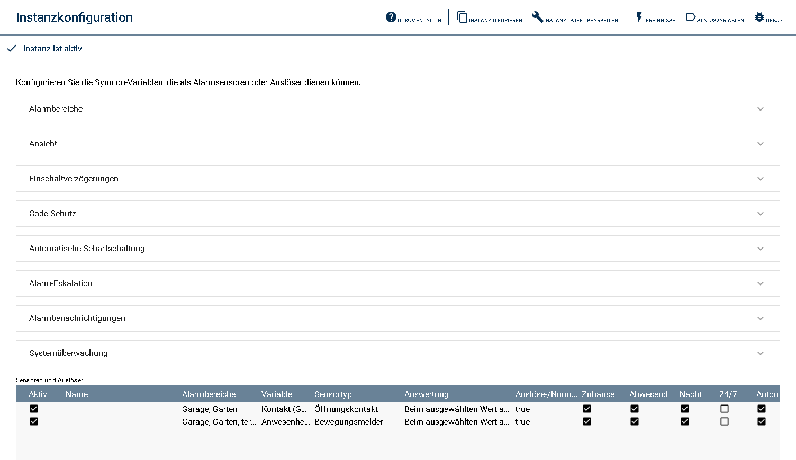
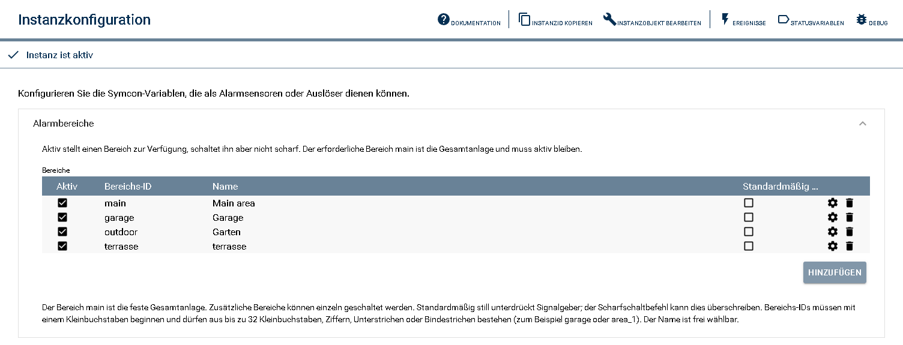
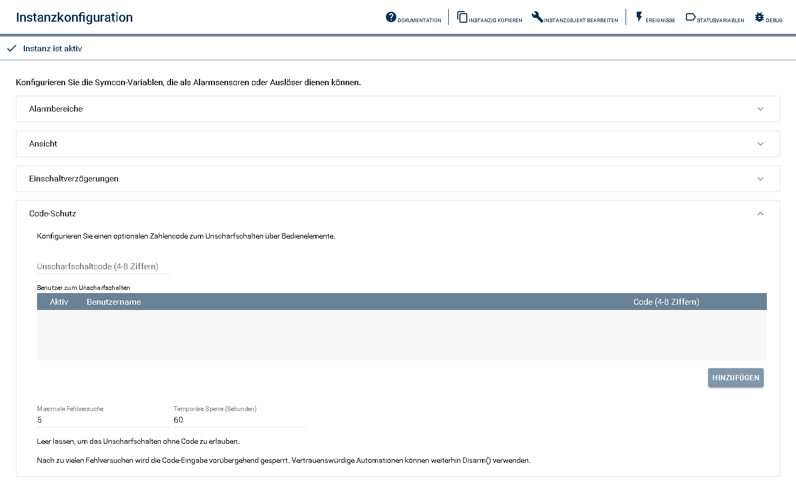
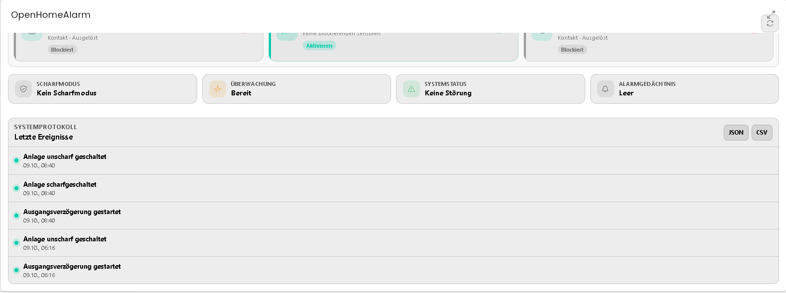
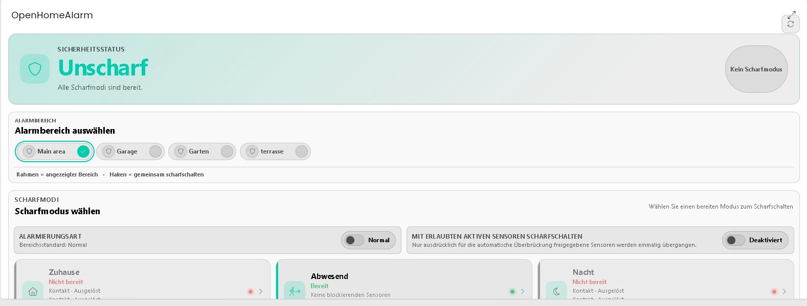
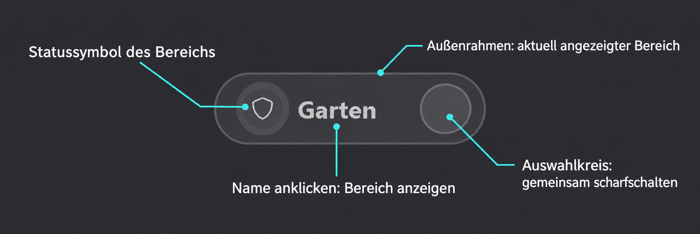
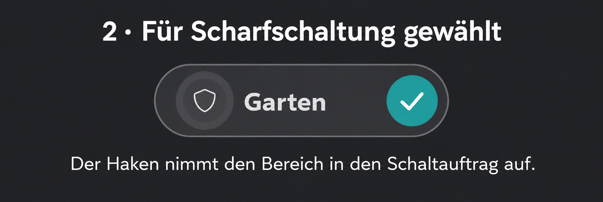
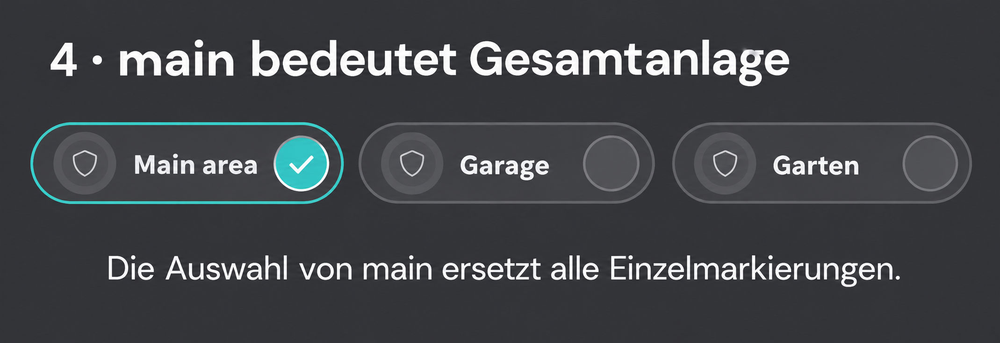
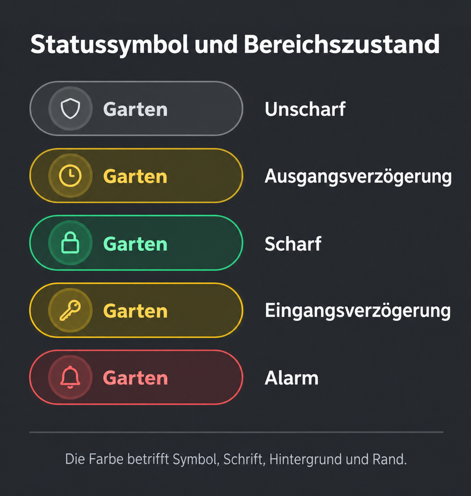
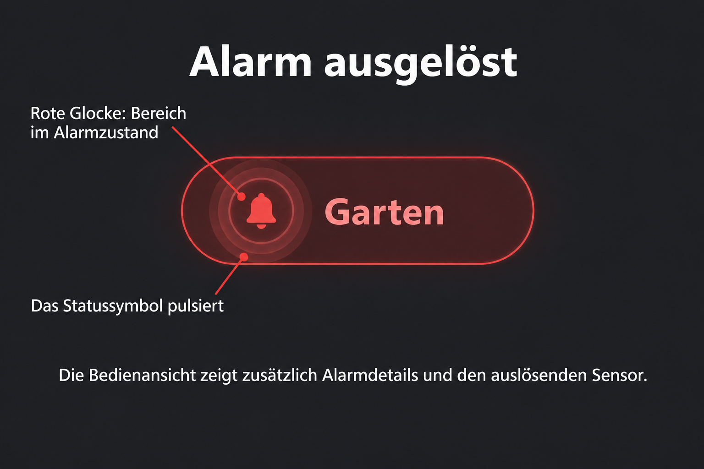

# OpenHomeAlarm

OpenHomeAlarm ist eine herstellerunabhängige Alarm- und Sicherheitslogik für
Symcon. Bereits vorhandene Symcon-Variablen können als Sensoren,
24/7-Auslöser oder technische Störungseingänge verwendet werden. Das Modul
übernimmt die Zustandsführung, Scharfschaltung, Verzögerungen, Alarmreaktionen,
Benachrichtigungen und die Bedienung über Kachel, IPSView oder PHP-Skripte.

> **Funktionsstatus:** OpenHomeAlarm stellt eine vollständige, praktisch auf Symcon 9.x geprüfte Alarmsteuerung bereit. Dazu gehören unabhängige Alarmbereiche, mehrere Scharfmodi, wiederanlaufsichere Verzögerungen, 24/7-Sensoren, Störungsüberwachung, Sensorüberbrückungen, Benutzer-Codeschutz, automatische Scharfschaltung, Alarmaktionen und Eskalationsstufen, Alarmgedächtnis, Ereignis- und Diagnoseexporte sowie eine versionierte Konfigurationssicherung. Die HTML-SDK-Kachel und die IPSView-WebContent-Seite verwenden denselben Bedienzustand und Funktionsumfang.

> **Sicherheitshinweis:** OpenHomeAlarm ist keine zertifizierte Einbruch-, Brand- oder Gefahrenmeldeanlage. Die Verfügbarkeit hängt von Symcon, Hostsystem, Netzwerk, Sensoren und konfigurierten Aktionen ab. Für normativ oder versicherungsrechtlich geforderte Schutzaufgaben ist geeignete zertifizierte Sicherheitstechnik erforderlich. Weitere Hinweise enthält die [Sicherheitsrichtlinie](../SECURITY.md).

## 1. Schnellstart

1. Installieren Sie die Library über die Symcon-Modulverwaltung und legen Sie eine
   **OpenHomeAlarm**-Instanz an.
2. Prüfen Sie unter **Alarmbereiche**, dass `main` aktiv ist. `main` ist fest
   die Gesamtanlage; weitere Bereiche wie `garage` können später einzeln
   bedient werden.
3. Öffnen Sie **Sensoren und Auslöser**, klicken Sie auf **Hinzufügen**, wählen
   Sie eine Symcon-Variable und ordnen Sie den Sensor mindestens einem Bereich
   und einem Scharfmodus zu. Ein Sensor darf mehreren Bereichen zugeordnet werden.
4. Übernehmen Sie die Konfiguration und öffnen Sie die HTML-SDK-Kachel. Im
   unscharfen Zustand wählen Sie **Zuhause**, **Abwesend** oder **Nacht**.
   Wählen Sie `main` für alle aktiven Bereiche oder einen anderen Bereich für
   eine Einzelbedienung.
5. Testen Sie anschließend Unscharfschaltung, Sensorblockade und – falls
   eingerichtet – die Alarmaktion. Erst danach sollten automatische Pläne oder
   Eskalationsstufen aktiviert werden.

**Wichtig:** „Aktiv“ bei einem Bereich oder Sensor bedeutet nur verfügbar – es
schaltet noch nichts scharf. Ein Scharfschaltversuch über `main` wird vollständig
abgelehnt, sobald ein aktiver Bereich nicht bereit ist; es gibt keine teilweise
aktivierte Anlage.

## Inhaltsverzeichnis

1. [Schnellstart](#1-schnellstart)
2. [Funktionsumfang und Zustandsmodell](#2-funktionsumfang-und-zustandsmodell)
3. [Voraussetzungen und Installation](#3-voraussetzungen-und-installation)
4. [Grundkonfiguration](#4-grundkonfiguration)
5. [Alarmbereiche einrichten und bedienen](#5-alarmbereiche-einrichten-und-bedienen)
6. [Statusvariablen](#6-statusvariablen)
7. [Sensoren und Auslöser](#7-sensoren-und-auslöser)
8. [Temporäre Durchgangsfreigabe](#8-temporäre-durchgangsfreigabe)
9. [Systemüberwachung](#9-systemüberwachung)
10. [Code-Schutz](#10-code-schutz)
11. [Automatische Scharfschaltung](#11-automatische-scharfschaltung)
12. [Alarmaktionen und Benachrichtigungen](#12-alarmaktionen-und-benachrichtigungen)
13. [Alarmgedächtnis](#13-alarmgedächtnis)
14. [Ereignisprotokoll und Diagnose](#14-ereignisprotokoll-und-diagnose)
15. [Konfigurationssicherung](#15-konfigurationssicherung)
16. [Kachel und IPSView](#16-kachel-und-ipsview)
17. [PHP-Befehlsreferenz](#17-php-befehlsreferenz)

## 2. Funktionsumfang und Zustandsmodell

Das Modul stellt das grundlegende Zustandsmodell der Alarmanlage, ein herstellerunabhängiges Sensor-/Trigger-Datenmodell, die aktive Sensorüberwachung, die globale und modusabhängige Scharfschaltbereitschaft inklusive der jeweils blockierenden Sensoren, die zielmodusabhängige Scharf-/Unscharf-Logik, temporäre Sensorüberbrückungen für einen Scharfschaltzyklus, einmalige zeitbegrenzte Durchgangsfreigaben im scharfen Zustand, dauerhaft aktive 24/7-Sensoren, timerbasierte Ein-/Ausgangsverzögerungen mit laufendem Countdown-Status, optionaler Countdown-Aktion und Ausgangsweg-Sensoren, konfigurierbare Alarm-Eskalationsaktionen mit optionaler automatischer Alarmdauer und separatem Stoppen von Signalgebern, eine 24/7-Systemüberwachung für Manipulation, Batterie-/Stromversorgung, Kommunikation und Gerätestörungen mit optionaler Scharfschaltblockade oder Alarmauslösung, eine optionale Code-Prüfung zum Unscharfschalten, ein quittierbares Alarmgedächtnis, ein persistentes Sicherheits-Ereignisprotokoll sowie eine versionierte öffentliche Bedien-API bereit. Betriebsmodus und Systemzustand werden bewusst getrennt geführt, damit beispielsweise ein Alarm weiterhin erkennen lässt, ob zuvor Zuhause-, Abwesend- oder Nachtbetrieb aktiv war.

Symcon-Variablen können als Sensor oder Auslöser hinterlegt und den Scharfmodi Zuhause, Abwesend und Nacht zugeordnet werden. Zusätzlich kann ein Sensor als **24/7 aktiv** markiert werden und löst dann unabhängig vom Scharfmodus sofort aus. Sensortyp, Auswertung sowie die Nutzung als Ausgangsweg und der Eingangsverzögerung werden ebenfalls gespeichert. Die Auswertung erfolgt wahlweise beim ausgewählten **Auslösewert** oder bei jeder **Abweichung vom Normalwert**. Boolean-, String- und numerische Zustände werden dabei einheitlich als Auswahlliste mit den in Symcon hinterlegten Beschriftungen angeboten. Für Bewegungsmelder oder vergleichbare Sensoren kann zusätzlich **Alarm bei erneuter Auslösung verlängern** aktiviert werden. Löst ein solcher Sensor während eines laufenden Alarms erneut aus, beginnt die Alarmdauer erneut und die Eskalationsaktionen werden noch einmal ausgeführt.

Jeder Sensor und Störungseingang bleibt über seine Symcon-Variablen-ID zugeordnet,
auch wenn mehrere Variablen denselben Namen tragen oder später umbenannt werden.
Ein konfigurierter Name hat Vorrang, andernfalls erscheint der aktuelle
Symcon-Name. Auch bei gleichen Anzeigenamen bleiben die Quellen intern
getrennt; IDs werden nicht an die sichtbaren Namen angehängt.

Ausgangs- und Eingangsverzögerung sind global in Sekunden konfigurierbar. Der Wert `0` deaktiviert die jeweilige Verzögerung. Sensoren können zusätzlich als **Ausgangsweg (nur Abwesend)** markiert werden. Bei aktivierter Ausgangsverzögerung dürfen sie ausschließlich beim Start des Scharfmodus **Abwesend** bereits ausgelöst sein. Für **Zuhause** und **Nacht** gelten sie wie normale Sensoren und blockieren die Scharfschaltung sofort. Ein Bewegungsmelder des Ausgangswegs darf bei **Abwesend** auch am Countdown-Ende noch aktiv sein, weil sein Boolean-Wert nach einer Bewegung häufig nachläuft. Nach dem Scharfschalten wird er beim Zurückkehren in den Ruhezustand wieder regulär ausgewertet und löst bei der nächsten Aktivierung Alarm aus. Andere Sensortypen des Ausgangswegs, insbesondere Öffnungskontakte, müssen am Countdown-Ende bereit sein. Bei deaktivierter Ausgangsverzögerung gelten Ausgangswegsensoren auch für **Abwesend** wie normale Sensoren und müssen bereits vor dem Scharfschalten bereit sein. Während eines laufenden Countdowns steht die verbleibende Zeit in der öffentlichen Statusabfrage `OHA_GetControlState($InstanzID)` bereit. Bei einer Eingangsverzögerung enthält sie zusätzlich den Sensor, der den Countdown gestartet hat; die Werte werden beim Abbruch, Abschluss oder Alarm zurückgesetzt. Die optionale **Countdown-Aktion** wird für jeden positiven Wert genau einmal ausgeführt. Die getrennte **Aktion nach Ende des Countdowns** läuft danach genau einmal – sowohl beim regulären Ablauf als auch bei einem kontrollierten Abbruch durch Unscharfschalten oder eine Durchgangsfreigabe. Ein Aktionsskript kann `OHA_GetControlState($InstanzID)` verwenden, um etwa Restzeit, auslösenden Sensor, Scharfmodus und Zustand für eine Sprachausgabe oder Signaltöne auszuwerten. Für einen Boolean-Signalgeber wird daher beispielsweise in der Countdown-Aktion ausdrücklich `true` und in der Abschlussaktion ausdrücklich `false` gewählt; OpenHomeAlarm errät oder invertiert den Rücksetzwert nicht. Die laufende Frist und der zuletzt ausgeführte Countdown-Schritt sind wiederanlaufsicher, sodass `ApplyChanges()` oder ein Symcon-Neustart weder einen Schritt noch die Abschlussaktion doppelt ausführen. Alarmreaktionen werden als Eskalationsaktionen konfiguriert. Die Alarmdauer ist global in Sekunden konfigurierbar; der Standardwert `0` lässt den Alarmausgang aktiv, bis er manuell zurückgesetzt oder die Anlage unscharf geschaltet wird. Ist eine Alarmdauer größer als `0`, ist **Nach Ablauf der Alarmdauer automatisch wieder scharf schalten** standardmäßig aktiv: Der betroffene Bereich wird nach dem Zurücksetzen der Alarmaktionen nur im vorherigen Modus wieder scharf, wenn kein relevanter Sensor ausgelöst und keine blockierende Störung aktiv ist. Das Alarmgedächtnis bleibt dabei als Nachweis erhalten. Für einen erkannten Fehlalarm steht in der Kachel zusätzlich **Fehlalarm zurücksetzen** bereit. Diese Schaltfläche setzt Aktionen und Alarmgedächtnis zurück und schaltet den Bereich ebenfalls nur bei voller Bereitschaft wieder scharf. Für benutzerseitiges Unscharfschalten kann optional ein vier- bis achtstelliger Zahlencode hinterlegt werden.

OpenHomeAlarm trennt den gewählten **Scharfmodus** vom aktuellen
**Systemzustand**:

| Scharfmodus | Bedeutung |
| --- | --- |
| Kein Scharfmodus | Der Bereich ist unscharf. |
| Zuhause | Die für Anwesenheit ausgewählten Sensoren werden überwacht. |
| Abwesend | Die für Abwesenheit ausgewählten Sensoren werden überwacht. |
| Nacht | Die für den Nachtbetrieb ausgewählten Sensoren werden überwacht. |

| Systemzustand | Bedeutung |
| --- | --- |
| Unscharf | Sensoren der drei Scharfmodi lösen keinen Einbruchalarm aus; 24/7-Sensoren bleiben aktiv. |
| Ausgangsverzögerung | Die Scharfschaltung wurde gestartet, der konfigurierte Countdown läuft. |
| Scharf | Die Sensoren des gewählten Modus werden überwacht. |
| Eingangsverzögerung | Ein entsprechend konfigurierter Sensor hat ausgelöst; vor dem Alarm läuft der Countdown. |
| Alarm | Mindestens ein Sensor hat einen Alarm ausgelöst. |

## 3. Voraussetzungen und Installation

### Voraussetzungen

- Symcon ab Version 9.0
- vorhandene Symcon-Variablen für die gewünschten Sensoren und Auslöser
- für IPSView eine HTML-Box mit dem Renderer **Browser des Clients**

### Installation

1. Öffnen Sie die Modulverwaltung von Symcon.
2. Installieren Sie die Library aus dem GitHub-Repository
   `Burki24/OpenHomeAlarm`.
3. Legen Sie über **Instanz hinzufügen** eine Instanz vom Typ
   **OpenHomeAlarm** an.
4. Öffnen Sie die Instanzkonfiguration und richten Sie zuerst Alarmbereiche und
   Sensoren ein.

## 4. Grundkonfiguration

Die folgende Reihenfolge vermeidet unvollständige oder widersprüchliche
Konfigurationen:

1. **Alarmbereiche** anlegen. Der vorhandene Bereich `main` bleibt aktiv.
2. **Sensoren und Auslöser** hinzufügen und einem oder mehreren Bereichen
   zuordnen.
3. **Ausgangs- und Eingangsverzögerung** festlegen. `0` deaktiviert die
   jeweilige Verzögerung.
4. Optional **Countdown-Aktionen** für Ansagen, Gong oder Statusanzeigen und
   eine getrennte **Aktion nach Ende des Countdowns** zum sicheren Ausschalten
   hinterlegen.
5. Optional **Systemüberwachung**, **Code-Schutz** und **automatische
   Scharfschaltung** einrichten.
6. Unter **Alarmaktionen** mindestens die gewünschten Reaktionen und deren
   Rücksetzverhalten konfigurieren.
7. Benachrichtigungen und Visualisierungen erst danach ergänzen.
8. Änderungen übernehmen und alle vorgesehenen Zustände praktisch testen.

Die Instanzkonfiguration bündelt die seltener benötigten Einstellungen in
aufklappbaren Abschnitten. **Sensoren und Auslöser** bleiben darunter direkt
sichtbar, damit Zuordnungen und Bereitschaftsregeln schnell kontrolliert werden
können. Die folgende Abbildung zeigt eine Beispielkonfiguration; Namen und
Bereichs-IDs sind installationsabhängig.



| Konfigurationsbereich | Aufgabe | Wichtige Vorgabe |
| --- | --- | --- |
| Alarmbereiche | Gesamtanlage und getrennt schaltbare Bereiche | `main` bleibt als Gesamtanlage aktiv. |
| Verzögerungen | Zeit zum Verlassen oder Betreten | Standardmäßig jeweils 30 Sekunden; `0` deaktiviert. |
| Countdown-Aktionen | Aktion bei jeder positiven Countdown-Sekunde | Eine leere Liste führt nichts aus. |
| Aktion nach Ende des Countdowns | Einmalige Abschlussaktion nach regulärem Ende oder kontrolliertem Abbruch | Für Ton, Licht oder Anzeige eine ausdrückliche Ausschaltaktion wählen. |
| Sensoren und Auslöser | Alarmquellen, Scharfmodi und Sonderverhalten | Sensoren werden über ihre Variablen-ID identifiziert. |
| Systemüberwachung | Manipulation, Batterie, Kommunikation und Gerätestörung | Störungen können blockieren oder 24/7 Alarm auslösen. |
| Code-Schutz | Geschützte Benutzerbedienung | Vier bis acht Ziffern; direkte vertrauenswürdige APIs bleiben codefrei. |
| Automatische Scharfschaltung | Wöchentliche Zeitpläne | Verpasste Schaltungen werden nicht nachgeholt. |
| Alarmaktionen | Eskalation, Signalgeber und Rücksetzung | Signalgeber laufen ausschließlich bei normalem Alarm. |
| Push/Pushover | Alarmbenachrichtigungen | Für normal, still oder beide Alarmierungsarten wählbar. |
| Symcon-Kachel/IPSView | Darstellung und Bedienung | Beide Oberflächen verwenden denselben Bedienzustand. |

Änderungen an Alarmbereichen, Sensoren und Störungseingängen werden nur bei
vollständig unscharfer Anlage übernommen. Laufende Sicherheitszustände können
dadurch nicht unbemerkt durch eine neue Konfiguration verändert werden.

## 5. Alarmbereiche einrichten und bedienen

Mit Alarmbereichen können beispielsweise Wohnhaus und Garage unabhängig voneinander scharf- und unscharf geschaltet werden. `main` ist dabei fest die **Gesamtanlage**: Scharf- und Unscharfschalten über ihn wirkt auf alle aktiven Bereiche.

### Beispiel: Bereich „Garage“ einrichten

**1. Bereich anlegen**

In der Instanzkonfiguration unter **Alarmbereiche** auf **Hinzufügen** klicken und folgende Werte eintragen:

| Feld | Wert im Beispiel | Bedeutung |
| --- | --- | --- |
| Aktiv | Ein | Der Bereich kann verwendet werden. Er ist dadurch noch nicht scharfgeschaltet. |
| Bereichs-ID | `garage` | Technischer Schlüssel für Zuordnungen und PHP-Befehle |
| Name | `Garage` | Frei wählbarer Anzeigename |

Danach **Änderungen übernehmen**. Der vorhandene Bereich `main` muss aktiv bleiben; er wird nicht ausgewählt, sondern ist fest die Gesamtanlage.



**2. Sensoren zuordnen**

Den gewünschten Eintrag unter **Sensoren und Auslöser** bearbeiten. Im Editor werden alle aktiven Alarmbereiche als Checkboxen angezeigt. **Garage** aktivieren und die Änderungen übernehmen. Ein Sensor kann gleichzeitig mehreren Bereichen zugeordnet werden; sein Zustand beeinflusst dann die Bereitschaft jedes zugeordneten Bereichs und löst nur in den jeweils scharfgeschalteten beziehungsweise bei 24/7-Sensoren in allen zugeordneten Bereichen aus. Neue Sensoren sind automatisch `main` zugeordnet. Störungseingänge bleiben einem einzelnen Bereich zugeordnet und verwenden bei neuen Einträgen ebenfalls automatisch `main`.

Temporäre Überbrückungen gelten immer nur für den aktuell ausgewählten Bereich. Ist derselbe Sensor beispielsweise **Haus** und **Garage** zugeordnet, lässt eine Überbrückung in **Garage** seine Überwachung in **Haus** unverändert.

Eine überwachte Tür kann über die ausdrücklich freizugebende
**Durchgangsfreigabe** einmal geöffnet und geschlossen werden, während ihr
Alarmbereich scharf bleibt. Einrichtung, Sicherheitsgrenzen und ein
vollständiges Ereignisskript beschreibt Kapitel
[Temporäre Durchgangsfreigabe](#8-temporäre-durchgangsfreigabe).

**3. Einzelnen Bereich oder Gesamtanlage schalten**

Ein Symcon-Skript anlegen und folgenden Befehl verwenden:

```php
OHA_ArmPartition(12345, 'garage', 'away', null);
```

- `12345` durch die Objekt-ID der OpenHomeAlarm-Instanz ersetzen.
- `garage` ist die zuvor eingetragene Bereichs-ID.
- `away` ist der Scharfmodus. Zulässig sind `home`, `away` und `night`.
- `null` verwendet die konfigurierte Ausgangsverzögerung. `0` schaltet ohne
  Verzögerung scharf; eine positive Zahl überschreibt die Verzögerung für
  diesen einzelnen Aufruf.
- Der Befehl verändert keinen anderen Alarmbereich.
- Ein optionaler fünfter Parameter wählt die Alarmierungsart: `true` für still,
  `false` für normal und ohne Angabe die Bereichsvorgabe.

Für die Gesamtanlage verwenden Sie `main` beziehungsweise die bestehenden Befehle ohne Bereichs-ID:

```php
// Alle aktiven Bereiche im Abwesend-Modus scharfschalten
OHA_ArmAway(12345, null);

// Alle aktiven Bereiche unscharf schalten
OHA_Disarm(12345);
```

**Mehrere, aber nicht alle Bereiche gemeinsam schalten**

Für eine frei gewählte Teilmenge verwenden Sie die Mehrbereichsbefehle. Das
folgende Beispiel schaltet **Garage** und **Schuppen** gemeinsam, lässt aber
beispielsweise **Garten** und `main` unverändert:

```php
OHA_ArmPartitions(
    12345,
    ['garage', 'schuppen'],
    'away',
    null
);

// Vertrauenswürdige Automation: dieselben beiden Bereiche unscharf schalten
OHA_DisarmPartitions(12345, ['garage', 'schuppen']);
```

OpenHomeAlarm prüft den vollständigen Auftrag, bevor es einen Bereich ändert.
Ist Garage bereit, Schuppen aber blockiert, wird **keiner** der beiden Bereiche
scharfgeschaltet. Eine unbekannte oder deaktivierte Bereichs-ID lehnt den
gesamten Auftrag ebenfalls ab. Doppelte IDs sind harmlos und werden nur einmal
verarbeitet. Sobald die Liste `main` enthält, gilt der Auftrag absichtlich für
die Gesamtanlage; für eine echte Teilmenge darf `main` deshalb nicht in der
Liste stehen.

In Kachel und IPSView vereint bei mindestens drei verfügbaren Bereichen jeder
Bereichsbutton zwei getrennte Bedienziele: Ein Klick auf Namen beziehungsweise
Status wählt den Bereich für die Detailanzeige; der türkisfarbene Außenrahmen
kennzeichnet diese Auswahl. Der eigene Auswahlkreis rechts im selben Button
nimmt den Bereich in die nächste gemeinsame Scharfschaltung auf oder entfernt
ihn daraus; ein Haken kennzeichnet die gewählten Zielbereiche. Bis erstmals
ein Auswahlkreis bedient wird, folgt das einzelne Schaltziel weiterhin der
gewohnten Detailauswahl. Die Auswahl `main` bedeutet auch im Auswahlkreis
Gesamtanlage und ersetzt deshalb einzelne Markierungen.

Sobald einer der gewählten Zielbereiche geschaltet wird oder scharf ist,
werden die Auswahlkreise ausgeblendet; die Bereichsbuttons bleiben für die
Detailauswahl verfügbar. Gehört der angezeigte Bereich beim Scharfschalten
nicht zur gewählten Teilmenge, folgt die Detailanzeige automatisch dem ersten
Zielbereich und zeigt dessen Ausgangsverzögerung und Countdown. Ein bereits
beteiligter angezeigter Bereich bleibt ausgewählt. Die Detailauswahl bestimmt
außerdem, welcher Einzelbereich später unscharf geschaltet wird. Eine bewusste
Ausnahme ist `main`: Sobald mindestens ein Bereich aktiv ist, bietet die
Oberfläche bei ausgewähltem Hauptbereich **Alle Bereiche deaktivieren** an.
Damit lassen sich beliebige zuvor gemeinsam oder einzeln scharfgeschaltete
Teilbereiche mit einer Aktion und – falls eingerichtet – einer einzigen
Code-Eingabe unscharf schalten. Bei Auswahl eines Einzelbereichs bleibt die
Deaktivierung auf genau diesen Bereich begrenzt. Die codefreie Funktion
`OHA_DisarmPartitions()` ist ausschließlich für vertrauenswürdige eigene
Automationen gedacht.

Bei `OHA_ArmPartition()`, `OHA_ArmHome()`, `OHA_ArmAway()` und `OHA_ArmNight()`
muss der Parameter für die Ausgangsverzögerung im von Symcon erzeugten
`OHA_*`-Befehl immer angegeben werden. `null` verwendet die in der Instanz
konfigurierte Ausgangsverzögerung, `0` schaltet ohne Verzögerung scharf und eine
positive Zahl überschreibt die Verzögerung für diesen einzelnen Aufruf. Für den
allgemeinen Befehl gilt entsprechend zum Beispiel `OHA_Arm(12345, 'away', null)`.
Als optionaler Parameter kann bei allen Scharfbefehlen `true` (still)
oder `false` (normal) übergeben werden, beispielsweise
`OHA_ArmPartition(12345, 'garage', 'away', null, true)`. Ohne diesen Parameter
verwendet jeder Bereich seine eigene Vorgabe **Standardmäßig stiller Alarm**.
Bei einer Gesamtschaltung überschreibt ein ausdrücklich angegebener Wert die
Vorgabe aller Bereiche nur für diesen Scharfschaltzyklus.
Der danach folgende letzte Parameter aktiviert mit `true` für diesen Aufruf
die automatische Überbrückung bereits ausgelöster, am Sensor einzeln
freigegebener Kontakte. Beispiel für einen Symcon-Wochenplan:
`OHA_ArmPartition(12345, 'garage', 'night', null, null, true)`.
Ohne diesen Parameter bleibt die Bereitschaftsprüfung unverändert streng.

Vor dem Scharfschalten prüft OpenHomeAlarm alle vom konkreten Auftrag erfassten
Bereiche. Bei `main` sind dies alle aktiven Bereiche, beim Mehrbereichsbefehl
genau die genannten Bereiche. Blockiert ein Sensor oder Störungseingang einen
dieser Bereiche, bleibt der vollständige Auftrag ohne Teilzustand abgewiesen.

### Beispiel: Hotelschalter oder Kartenleser

Liefert eine Integer-Variable beim Einstecken der Karte den Wert `16` und ohne
Karte den Wert `0`, kann sie über ein Ereignis **Bei Änderung** mit folgendem
Aktionsskript angebunden werden:

```php
<?php

$alarmInstanzID = 12345;

if ((int) $_IPS['VALUE'] === 16) {
    // Karte eingesteckt: Abwesend ohne Ausgangsverzögerung scharfschalten
    OHA_ArmAway($alarmInstanzID, 0);
} elseif ((int) $_IPS['VALUE'] === 0) {
    // Keine Karte: Gesamtanlage unscharf schalten
    OHA_Disarm($alarmInstanzID);
}
```

`12345` wieder durch die Objekt-ID der OpenHomeAlarm-Instanz ersetzen. Soll beim
Einstecken der Karte die konfigurierte Ausgangsverzögerung laufen, im Aufruf
`OHA_ArmAway($alarmInstanzID, null)` statt `0` verwenden. Die Werte `16` und `0`
müssen zu den tatsächlichen Werten der verwendeten Variable passen.

**4. Nur die Garage unscharf schalten**

```php
OHA_DisarmPartition(12345, 'garage');
```

Auch dieser Befehl verändert keinen anderen Alarmbereich.

### Was bedeuten die Begriffe?

| Begriff | Bedeutung |
| --- | --- |
| Aktiv | Der Bereich steht zur Verfügung und kann Sensoren erhalten. Das ist kein Scharfbefehl. |
| `main` | Feste Gesamtanlage. Die Befehle ohne Bereichsangabe sowie die Auswahl `main` in Kachel und IPSView schalten alle aktiven Bereiche gemeinsam; Kachel und IPSView können weiterhin einzelne Bereiche auswählen |
| Scharfgeschaltet | Laufzeitzustand eines Bereichs; seine zugeordneten Sensoren werden entsprechend dem gewählten Modus überwacht |

Die HTML-SDK-Kachel und die IPSView-Seite zeigen unterhalb des
Sicherheitsstatus eine Bereichsauswahl. Scharf-/Unscharfschaltung,
Bereitschaft, Diagnose, Alarmgedächtnis und Sensorüberbrückungen beziehen sich
auf den dort für die Detailansicht gewählten Bereich. Die öffentlichen
PHP-Funktionen stehen zusätzlich für Automationen zur Verfügung.

Vor dem Scharfschalten zeigt ein Switch in Kachel und IPSView zunächst die
Bereichsvorgabe für normalen oder stillen Alarm. Ein Klick wechselt die
Alarmierungsart für diesen Scharfschaltzyklus; ein weiterer Klick kehrt zur
Bereichsvorgabe zurück. Ein stiller Alarm behält den
Alarmzustand, das Alarmgedächtnis und die Benachrichtigungen bei, unterdrückt
aber als **Signalgeber** markierte Aktionen. Die gewählte Alarmierungsart wird
im Bedienzustand (`Silent`) je Bereich angezeigt und auch nach einem Neustart
beibehalten.

Besitzt mindestens ein aktueller Blocker die Sensorfreigabe **Automatische
Überbrückung erlauben**, erscheint zusätzlich der Switch **Mit erlaubten
aktiven Sensoren scharfschalten**. Er gilt nur für den unmittelbar folgenden
Scharfschaltversuch. OpenHomeAlarm überbrückt ausschließlich bereits
ausgelöste normale Sensoren, die einzeln dafür freigegeben wurden. Fehlende
Sensoren, 24/7-Sensoren, blockierende Störungen und nicht freigegebene aktive
Sensoren bleiben Blocker. Bei `main` werden alle erfassten Bereiche geprüft;
bei einer Mehrfachauswahl nur die gewählten Bereiche. Erreicht ein automatisch
überbrückter Sensor später seinen Normalzustand, wird er sofort wieder normal
überwacht.

Auf ausreichend breiten Ansichten stehen die Schalter für Alarmierungsart und
automatische Überbrückung platzsparend nebeneinander. Bei geringerer Breite
ordnet die gemeinsame responsive Darstellung sie automatisch untereinander an.

### Regeln für die Bereichs-ID

- 1 bis 32 Zeichen
- beginnt mit einem Kleinbuchstaben
- danach sind Kleinbuchstaben, Ziffern, `_` und `-` zulässig
- keine Leerzeichen, Großbuchstaben oder Umlaute

Gültig sind beispielsweise `main`, `garage`, `erdgeschoss`, `bereich_1` und `aussen-2`. Ungültig sind `1`, `Garage`, `außen` und `mein bereich`. Da die ID in Zuordnungen und Skripten verwendet wird, sollte sie später nicht ohne Anpassung dieser Verwendungen geändert werden.

### Technischer Hintergrund

Änderungen an Bereichen, Sensoren und Störungseingängen sind nur möglich, wenn alle Bereiche unscharf sind. Die Control API 3 veröffentlicht jeden aktiven Bereich mit eigenem Modus, Zustand, Countdown, Alarmausgang, Alarmgedächtnis und Durchgangsfreigabe unter `Partitions`; `DefaultPartition` ist stets `main`. `OHA_GetPartitions($InstanzID)` liefert die konfigurierten Bereichsmetadaten. Laufzeiten, Fristen und Alarmdaten werden neustartsicher gespeichert. Die Instanzvariablen `AlarmOutputActive`, `SignalGeneratorActive`, `AlarmMemory`, `LastAlarmSource` und `LastAlarmTime` fassen den Gesamtzustand aller Bereiche zusammen.

### Bereichsstatus in eigenen Skripten

Für Abhängigkeiten wie Licht, Heizung oder Anwesenheitssimulation verwenden Sie
`OHA_GetControlState($InstanzID)`. Die Variablen `Mode` und `State` unter der
Instanz bilden keinen einzelnen Alarmbereich ab. Jeder aktive Bereich liegt
unter `Partitions` und wird über seine Bereichs-ID angesprochen:

```php
$state = json_decode(OHA_GetControlState(12345), true, 512, JSON_THROW_ON_ERROR);
$garage = $state['Partitions']['garage'] ?? null;
$stateName = $garage['State']['Name'] ?? 'disarmed';

$garageIsArmed = in_array(
    $stateName,
    ['exit_delay', 'armed', 'entry_delay', 'alarm'],
    true
);
```

`$garageIsArmed` ist damit auch während der Ein- und Ausgangsverzögerung sowie
während eines Alarms `true`. Für den Scharfmodus steht zusätzlich
`$garage['Mode']['Name']` mit `home`, `away` oder `night` bereit. Eine fehlende
oder deaktivierte Bereichs-ID wird durch den Fallback als `disarmed` behandelt.

## 6. Statusvariablen

OpenHomeAlarm legt folgende schreibgeschützte Statusvariablen an:

| Variable | Bedeutung | Initialwert |
| --- | --- | --- |
| `Mode` | Gewählter Scharfmodus: Kein Scharfmodus, Zuhause, Abwesend oder Nacht | Kein Scharfmodus |
| `State` | Aktuelle Systemphase: Unscharf, Ausgangsverzögerung, Scharf, Eingangsverzögerung oder Alarm | Unscharf |
| `DelayRemaining` | Verbleibende Sekunden einer laufenden Ein- oder Ausgangsverzögerung | 0 s |
| `DelaySource` | Sensor, der die aktuelle Eingangsverzögerung gestartet hat; bei Ausgangsverzögerung leer | leer |
| `AlarmOutputActive` | Zeigt, ob der Alarmausgang innerhalb eines aktiven Alarms noch aktiv ist | Alarmausgang inaktiv |
| `SignalGeneratorActive` | Zeigt, ob mindestens eine als Signalgeber markierte Alarmaktion erfolgreich gestartet wurde und getrennt gestoppt werden kann | Signalgeber inaktiv |
| `ReadyToArm` | Konservative Gesamtbereitschaft über alle überwachten Sensoren | Bereit |
| `ReadyHome` | Scharfschaltbereitschaft für Zuhause | Bereit |
| `ReadyAway` | Scharfschaltbereitschaft für Abwesend | Bereit |
| `ReadyNight` | Scharfschaltbereitschaft für Nacht | Bereit |
| `BlockingHomeSensors` | Namen der Sensoren, die Zuhause aktuell blockieren | leer |
| `BlockingAwaySensors` | Namen der Sensoren, die Abwesend aktuell blockieren | leer |
| `BlockingNightSensors` | Namen der Sensoren, die Nacht aktuell blockieren | leer |
| `BypassedSensors` | Namen der aktuell temporär überbrückten Sensoren | leer |
| `AlarmMemory` | Zeigt an, ob seit der letzten Quittierung ein Alarm gespeichert ist | Kein Alarm gespeichert |
| `LastAlarmSource` | Name des Sensors, der den letzten Alarm ausgelöst hat | leer |
| `LastAlarmTime` | Zeitpunkt des letzten Alarms im Format `TT.MM.JJJJ HH:MM:SS` | leer |
| `SystemFault` | Zeigt an, ob ein Störungseingang aktiv/nicht auswertbar oder eine genutzte Sensorvariable nicht verfügbar ist | Keine Systemstörung |
| `ActiveFaults` | Namen aller aktiven bzw. nicht auswertbaren Störungseingänge und nicht verfügbaren Sensoren | leer |
| `BlockingFaults` | Aktive Störungen, die die Scharfschaltung aller Modi blockieren | leer |
| `LastFaultSource` | Name der zuletzt neu aufgetretenen Störung/Manipulation | leer |
| `LastFaultTime` | Zeitpunkt der zuletzt neu aufgetretenen Störung im Format `TT.MM.JJJJ HH:MM:SS` | leer |

Die Variablen verwenden native Symcon-Darstellungen. Bereits vorhandene Betriebszustände werden bei einem Modulupdate nicht auf die Initialwerte zurückgesetzt.

## 7. Sensoren und Auslöser

Jeder konfigurierte Eintrag enthält folgende Daten:

| Feld | Bedeutung |
| --- | --- |
| `Enabled` | Eintrag grundsätzlich aktiviert/deaktiviert |
| Alarmbereiche | Ein oder mehrere aktive Alarmbereiche; neue Sensoren sind `main` zugeordnet |
| `Name` | Frei wählbare Bezeichnung |
| `VariableID` | ID der verwendeten Symcon-Variable |
| `SensorType` | Öffnungskontakt, Bewegungsmelder, Glasbruch-, Rauch- oder Wassermelder, Panikauslöser oder sonstiger Auslöser |
| `TriggerCondition` | **Beim ausgewählten Wert auslösen** für die bisherige exakte Prüfung oder **Bei Abweichung vom Normalwert auslösen** für mehrwertige Zustandsvariablen |
| `TriggerValue` | Rohwert des Auslöse- beziehungsweise Normalzustands; diskrete Zustände werden aus der Variablendarstellung bzw. vorhandenen Profil-Assoziationen übernommen |
| `ArmHome` | Im Scharfmodus Zuhause relevant |
| `ArmAway` | Im Scharfmodus Abwesend relevant |
| `ArmNight` | Im Scharfmodus Nacht relevant |
| `AlwaysActive` | 24/7 aktiv; löst unabhängig vom Scharfmodus sofort aus |
| `AllowAutomaticBypass` | Erlaubt nur bei ausdrücklich aktivierter Scharfschaltoption das automatische Überbrücken eines bereits ausgelösten, normalen Sensors bis zu seinem nächsten Normalzustand |
| `AllowPassage` | Erlaubt einer vertrauenswürdigen Automation, diesen normalen Sensor im scharfen Bereich zeitlich begrenzt für genau einen Auslöse-/Normalzyklus freizugeben |
| `ExitDelay` | Kennzeichnet einen Sensor des Ausgangswegs ausschließlich für **Abwesend**; bei aktiver Ausgangsverzögerung darf er beim Start dieses Modus ausgelöst sein. Für **Zuhause** und **Nacht** bleibt er ein normaler Blocker. Bewegungsmelder dürfen bei **Abwesend** wegen ihres nachlaufenden Werts auch am Countdown-Ende aktiv sein |
| `EntryDelay` | Startet bei Auslösung im scharfen Betrieb die konfigurierte Eingangsverzögerung statt unmittelbar den Alarmzustand |

Beim Bearbeiten eines Eintrags liest OpenHomeAlarm die aktuelle Symcon-Variablendarstellung aus. Definierte Optionen einer Boolean- oder String-Wertanzeige, Aufzählungen sowie diskrete numerische Intervalle erscheinen immer als dieselbe Auswahlliste. Für ältere Variablen werden vorhandene Profil-Assoziationen ebenfalls übernommen. Nur wenn eine Variable keine diskreten Zustände bereitstellt, bleibt eine direkte Rohwerteingabe als Fallback sichtbar. Gespeichert wird weiterhin der Rohwert als String, damit das Sensor-Datenmodell stabil bleibt.

Die Vorgabe **Beim ausgewählten Wert auslösen** erhält das bisherige Verhalten: Nur der gewählte Wert gilt als ausgelöst. **Bei Abweichung vom Normalwert auslösen** ist für Variablen mit mehreren unsicheren Zuständen vorgesehen. Wird beispielsweise bei einem Fenstergriff, einem Nuki-Türschloss oder einem SYR-SafeTech-Status der sichere Zustand als Normalwert gewählt, gilt jeder andere gültige Wert als ausgelöst. Das ist bewusst keine mathematische Prüfung wie „größer als 0“, weil Zustandsnummern keine geordneten Messwerte sein müssen. Gibt es bei einem Gerät mehrere gleichermaßen sichere Zustände, muss daraus weiterhin zunächst per Skript oder Logik eine eindeutige Boolean- oder Zustandsvariable gebildet werden.

Aktive Sensoren werden per `VM_UPDATE` überwacht, sobald sie mindestens einem Scharfmodus zugeordnet oder als **24/7 aktiv** markiert sind. OpenHomeAlarm vergleicht den aktuellen Variablenwert typgerecht mit dem gespeicherten Rohwert und wendet anschließend die gewählte Auswertung an. Boolean-, Integer-, Float- und Stringwerte werden entsprechend ihrem tatsächlichen Variablentyp ausgewertet. Nicht lesbare oder ungültig konfigurierte Werte werden niemals durch eine invertierte Normalwertprüfung zu einem bestätigten Alarm, bleiben aber sicherheitsgerichtet nicht scharfschaltbereit und als Störung sichtbar. Nach `ApplyChanges()` oder einem Symcon-Neustart werden die aktuell anliegenden Sensorwerte zusätzlich erneut geprüft. Dadurch wird auch eine Auslösung erkannt, die während eines Neustarts erfolgt ist und deshalb kein neues `VM_UPDATE` mehr erzeugt. Bereits laufende Eingangsverzögerungen werden dabei nicht neu gestartet; ein gleichzeitig aktiver Sofortalarm-Sensor eskaliert weiterhin unmittelbar zum Alarm.

`ReadyToArm` bleibt als konservative Gesamtbereitschaft erhalten. Bei aktivierter Ausgangsverzögerung werden nur für **Abwesend** erreichbare, ausdrücklich markierte Sensoren des Ausgangswegs von der initialen Bereitschaftsprüfung ausgenommen. **Zuhause** und **Nacht** prüfen dieselben Sensoren bereits vor dem Scharfschalten streng. Am Ende des Abwesend-Countdowns gilt die Ausnahme nur noch für Bewegungsmelder, damit deren nachlaufender Auslösewert die Scharfschaltung nicht abbricht. Alle übrigen ausgelösten oder nicht auswertbaren Sensoren setzen die Bereitschaft weiterhin auf **Nicht bereit**. Zusätzlich zeigen `ReadyHome`, `ReadyAway` und `ReadyNight` die tatsächliche Scharfschaltbereitschaft des jeweiligen Modus. Ein beispielsweise nur für **Abwesend** relevanter offener Kontakt setzt deshalb `ReadyAway` auf **Nicht bereit**, während `ReadyHome` und `ReadyNight` weiterhin **Bereit** bleiben können. Die Variablen `BlockingHomeSensors`, `BlockingAwaySensors` und `BlockingNightSensors` nennen dabei direkt die Sensoren, die den jeweiligen Modus aktuell blockieren. Mehrere Sensoren werden kommasepariert ausgegeben; ohne konfigurierten Namen gilt der aktuelle Symcon-Name, bei fehlender Variable eine neutrale Bezeichnung ohne ID. 24/7-Sensoren wirken auf alle drei Modi. Andere Sensoren und blockierende Störungen werden am Countdown-Ende weiterhin strikt geprüft. Nicht mehr vorhandene oder nicht auswertbare relevante Sensorvariablen führen aus Sicherheitsgründen ebenfalls zu **Nicht bereit**, erscheinen in der passenden Blockierliste und werden zusätzlich als persistente Systemstörung ausgewiesen. Ein noch nicht vollständig konfigurierter Eintrag mit `VariableID = 0` wird ignoriert.

Beim Scharfschalten prüft OpenHomeAlarm die Sensoren, die dem angeforderten Zielmodus zugeordnet sind, sowie alle 24/7 aktiven Sensoren. Ein ausgelöster Sensor, der beispielsweise ausschließlich für **Abwesend** gilt, verhindert deshalb nicht das Scharfschalten von **Zuhause**. Fehlende oder nicht auswertbare Sensoren des angeforderten Modus blockieren die Scharfschaltung aus Sicherheitsgründen. Unvollständige Listeneinträge mit `VariableID = 0` bleiben weiterhin ohne Wirkung.

Nach erfolgreicher Scharfschaltprüfung wechselt OpenHomeAlarm bei einer Ausgangsverzögerung größer als `0` zunächst in **Ausgangsverzögerung**. Erst nach Ablauf des Timers wird erneut geprüft, ob der gewählte Modus scharfschaltbereit ist. Sind dann noch relevante Sensoren ausgelöst oder nicht auswertbar, wird der Scharfschaltvorgang sicher abgebrochen und die Anlage auf **Unscharf** zurückgesetzt. Bei `0` Sekunden wird unmittelbar scharfgeschaltet.

Löst im Zustand **Scharf** ein für den aktiven Modus relevanter Sensor aus, startet ein mit `EntryDelay` markierter Sensor die konfigurierte **Eingangsverzögerung**. Der Countdown wird durch das erneute Schließen des Sensors nicht abgebrochen und bei weiteren verzögerten Sensorereignissen nicht neu gestartet. Ein Sensor ohne Eingangsverzögerung wechselt unmittelbar in den Zustand **Alarm**. Das gilt ebenfalls, wenn während einer laufenden Eingangsverzögerung ein sofort auslösender Sensor anspricht. Nach Ablauf der Eingangsverzögerung wird ebenfalls **Alarm** gesetzt. Beim erstmaligen Eintritt in den Alarmzustand werden die fälligen Alarm-Eskalationsaktionen ausgeführt.

Manuelle Sensorüberbrückungen können ausschließlich im Zustand **Unscharf** gesetzt oder entfernt werden. Sie wirken auf alle zugeordneten Scharfmodi und bleiben für einen Scharfschaltzyklus bestehen. 24/7 aktive Sensoren können aus Sicherheitsgründen nicht überbrückt werden. Manuelle Überbrückungen werden persistent gespeichert, überstehen `ApplyChanges()` und Neustarts und werden beim Unscharfschalten automatisch gelöscht. `BypassedSensors` zeigt die derzeit überbrückten Sensoren an.

24/7 aktive Sensoren sind von den Scharfmodi unabhängig. Sie lösen sowohl im Zustand **Unscharf** als auch während Ausgangsverzögerung, **Scharf** oder Eingangsverzögerung unmittelbar einen **normalen Alarm** aus. Dies gilt auch, wenn der zugeordnete Bereich still scharfgeschaltet wurde; ein laufender stiller Alarm wird dann zum normalen Alarm mit Signalgebern hochgestuft. Für solche Sensoren sind die Auswahlen Zuhause, Abwesend und Nacht sowie `AllowAutomaticBypass`, `AllowPassage`, `ExitDelay` und `EntryDelay` deaktiviert. Bereits gespeicherte Werte für diese Felder werden ignoriert. Ist ein 24/7-Sensor bei `ApplyChanges()` oder nach einem Symcon-Neustart bereits ausgelöst, wird dieser Zustand unmittelbar erkannt, sodass keine Überwachungslücke bis zur nächsten Variablenänderung entsteht. Typische Anwendungsfälle sind Rauch-, Wasser-, CO/CO₂- oder Panikauslöser; die Aktivierung bleibt jedoch bewusst eine explizite Benutzereinstellung.

Beim Unscharfschalten werden laufende Ein- und Ausgangsverzögerungen immer beendet. Ist der Alarmausgang zu diesem Zeitpunkt noch aktiv, wird er zuerst zurückgesetzt. Wird ein bereits aktiver Alarm unscharf geschaltet, wird anschließend einmalig die konfigurierte Aktion **Beim Unscharfschalten nach Alarm** ausgeführt. Ein Abbruch während Ein- oder Ausgangsverzögerung löst diese Aktion nicht aus. Die Timer für Ein-/Ausgangsverzögerung und Alarmdauer verwenden persistierte Ablaufzeitpunkte und werden nach `ApplyChanges()` bzw. einem Symcon-Neustart mit der verbleibenden Zeit wiederhergestellt.

Für eine einmalig gewählte Scharfschaltung darf ein bereits ausgelöster Sensor nur dann automatisch überbrückt werden, wenn am Sensor **Automatische Überbrückung erlauben** aktiviert wurde. Die Freigabe allein bewirkt nichts. Sobald ein so überbrückter Sensor seinen Normalzustand erreicht, wird er wieder überwacht und kann beim nächsten Auslösen Alarm geben. Nicht verfügbare Sensoren, 24/7-Sensoren und blockierende Störungen sind ausgeschlossen. Diese automatische Überbrückung bleibt über Neustarts erhalten, endet spätestens beim Unscharfschalten und wird in Status, Kachel, IPSView und Ereignisprotokoll sichtbar. Die bisherige manuelle Überbrückung bleibt dagegen bis zum Unscharfschalten bestehen. Hat ein Sensor während eines Symcon-Ausfalls geschlossen und wieder geöffnet, ist dieser Zwischenzustand nicht zuverlässig erkennbar; bei einem weiterhin ausgelösten Wert bleibt seine automatische Überbrückung deshalb bestehen.

## 8. Temporäre Durchgangsfreigabe

Die temporäre Durchgangsfreigabe erlaubt einer überwachten Tür genau einen
Öffnen-/Schließen-Zyklus, ohne den Alarmbereich unscharf zu schalten. Sie ist
für berechtigte Zutritte oder ein berechtigtes Verlassen gedacht, wenn
beispielsweise der Modus **Zuhause** aktiv bleiben soll.

Die mit `PassageTimeout` beziehungsweise dem Parameter `Frist` angegebene
Dauer wird in Sekunden übergeben. Ohne Angabe gelten **60 Sekunden**; zulässig
sind **1 bis 3.600 Sekunden**. Werte außerhalb dieses Bereichs werden
abgewiesen. Die Frist ist eine Sicherheitsgrenze für einen kurzen Durchgang
und nicht für stundenlange Betriebszustände vorgesehen. Ein erneuter Aufruf
verlängert eine bereits laufende Freigabe nicht. Ist der Sensor nach Beginn
des Durchgangs beim Fristablauf noch ausgelöst, erfolgt die normale
Alarmauslösung.

Die Durchgangsfreigabe ist keine allgemeine Sensorüberbrückung:

- Sie gilt nur für den ausdrücklich angegebenen Sensor und Alarmbereich.
- Der Sensor muss im aktuellen Scharfmodus überwacht werden.
- Am Sensor muss **Temporäre Durchgangsfreigabe erlauben** aktiviert sein.
- Sie endet nach dem ersten Auslösen und anschließenden Normalzustand.
- Sie endet außerdem beim Unscharfschalten, bei einem Alarm oder nach Ablauf
  der gewählten Frist.
- Andere Sensoren und alle 24/7-Sensoren bleiben aktiv.
- Pro Alarmbereich kann nur eine Durchgangsfreigabe gleichzeitig laufen.
- Ein wiederholter Aufruf verlängert eine laufende Freigabe nicht.

### Türkontakt und Verriegelungszustand getrennt behandeln

Bei einem Türschloss wie Nuki sollten zwei unterschiedliche Informationen nicht
als derselbe Sensor behandelt werden:

1. Der **Türkontakt** meldet, ob die Tür offen oder geschlossen ist. Er ist der
   eigentliche Alarmsensor.
2. Der **Verriegelungszustand** meldet, ob das Schloss verriegelt oder
   entriegelt ist. Er kann eine zusätzliche Scharfschaltvoraussetzung sein.

Eine sinnvolle Konfiguration kann so aussehen:

- Türkontakt: relevant für **Zuhause**, **Abwesend** und gegebenenfalls
  **Nacht**.
- Verriegelungszustand: zusätzlich nur für **Abwesend** relevant.

Damit muss die Haustür bei **Zuhause** geschlossen, aber nicht zwingend
abgeschlossen sein. Bei **Abwesend** kann zusätzlich verlangt werden, dass sie
wirklich verriegelt ist. Liefert eine Gerätevariable mehrere Zustände, die sich
nicht eindeutig auf diese beiden Aufgaben abbilden lassen, sollte der Anwender
daraus vorher per Skript oder Logik getrennte eindeutige Zustandsvariablen
bilden.

### Schritt 1: Türkontakt freigeben

1. Öffnen Sie **Sensoren und Auslöser**.
2. Bearbeiten Sie den Türkontakt.
3. Ordnen Sie ihn dem gewünschten Alarmbereich und den gewünschten
   Scharfmodi zu.
4. Aktivieren Sie **Temporäre Durchgangsfreigabe erlauben**.
5. Aktivieren Sie bei Bedarf **Eingangsverzögerung**.
6. Übernehmen Sie die Konfiguration im unscharfen Zustand.

Idealerweise erkennt die Zutrittsautomation die berechtigte Entriegelung,
bevor der Türkontakt öffnet. Meldet das Schloss die berechtigte Aktion erst
nach dem Öffnen, gibt die Eingangsverzögerung der Automation Zeit. Die
Durchgangsfreigabe darf dann genau die von diesem Türkontakt gestartete
Eingangsverzögerung bestätigen; der Bereich kehrt unmittelbar in **Scharf**
zurück. Ohne Eingangsverzögerung könnte der Alarm bereits ausgelöst sein, bevor
das Schlossereignis verarbeitet wurde.

### Schritt 2: Hilfsvariable anlegen

Legen Sie in Symcon eine eigene Boolean-Variable an, zum Beispiel
**Berechtigter Türdurchgang**. Diese Variable bleibt normalerweise `false` und
wird von der eigenen Zutrittsautomation nur bei einer sicher erkannten,
berechtigten Entriegelung auf `true` gesetzt.

Beispiel-IDs für die folgende Anleitung:

| Objekt | Beispiel-ID |
| --- | --- |
| OpenHomeAlarm-Instanz | `12345` |
| Türkontakt-Variable | `23456` |
| Hilfsvariable „Berechtigter Türdurchgang“ | `34567` |

Die Beispiel-IDs müssen vollständig durch die fünfstelligen IDs der eigenen
Installation ersetzt werden. Die Bereichs-ID `main` ist dagegen keine
Symcon-Objekt-ID, sondern der technische Schlüssel der Gesamtanlage.

### Schritt 3: Ereignisskript anlegen

Legen Sie ein PHP-Skript an und verbinden Sie es über ein Ereignis **Bei
Variablenänderung** mit der Hilfsvariable. Das Ereignis ruft das Skript auf,
wenn die Hilfsvariable auf `true` wechselt.

```php
<?php

declare(strict_types=1);

/*
 * Eigene Konfiguration
 */
$openHomeAlarmInstanceID = 12345;
$partitionIDs = ['main'];
$doorSensorVariableID = 23456;
$passageTriggerVariableID = 34567;
$passageTimeoutSeconds = 90;

/*
 * Nur auf die vorgesehene Hilfsvariable und nur auf true reagieren.
 */
if (
    ($_IPS['SENDER'] ?? '') !== 'Variable'
    || (int) ($_IPS['VARIABLE'] ?? 0) !== $passageTriggerVariableID
    || ($_IPS['VALUE'] ?? false) !== true
) {
    return;
}

try {
    $success = count($partitionIDs) === 1
        ? OHA_GrantPassagePartition(
            $openHomeAlarmInstanceID,
            $partitionIDs[0],
            $doorSensorVariableID,
            $passageTimeoutSeconds
        )
        : OHA_GrantPassagePartitions(
            $openHomeAlarmInstanceID,
            $partitionIDs,
            $doorSensorVariableID,
            $passageTimeoutSeconds
        );

    if (!$success) {
        IPS_LogMessage(
            'OpenHomeAlarm',
            'Die temporäre Durchgangsfreigabe wurde abgelehnt.'
        );
    }
} catch (Throwable $exception) {
    IPS_LogMessage(
        'OpenHomeAlarm',
        'Fehler bei der Durchgangsfreigabe: ' . $exception->getMessage()
    );
} finally {
    /* Für den nächsten berechtigten Zutritt zurücksetzen. */
    SetValueBoolean($passageTriggerVariableID, false);
}
```

Für einen eigenen Alarmbereich wird statt `main` dessen technische Bereichs-ID
eingetragen, beispielsweise `garage`. Ist derselbe Türkontakt mehreren
gleichzeitig scharfen Bereichen zugeordnet, verwenden Sie den atomaren
Mehrbereichsbefehl. Damit kann nicht versehentlich nur einer von zwei
überwachenden Bereichen freigegeben werden:

```php
$success = OHA_GrantPassagePartitions(
    12345,
    ['main', 'garage'],
    23456,
    90
);
```

OpenHomeAlarm prüft zuerst jeden genannten Bereich. Der Sensor muss in allen
genannten Bereichen für den aktuellen Scharfmodus überwacht und für die
Durchgangsfreigabe zugelassen sein; alle Bereiche müssen scharf oder in der
passenden Eingangsverzögerung sein. Scheitert eine einzige Prüfung, wird in
keinem Bereich eine Freigabe angelegt. Beachten Sie den Unterschied zur
Scharfschaltung: Bei der Durchgangsfreigabe ist `main` ein ausdrücklich
genannter Bereich und keine Abkürzung für alle weiteren Bereiche.

### Schritt 4: Zutrittsautomation verbinden

An der Stelle, an der die vorhandene Nuki-, Keypad-, Fingerprint- oder andere
Zutrittsautomation eine berechtigte Entriegelung erkennt, wird die
Hilfsvariable gesetzt:

```php
SetValueBoolean(34567, true);
```

OpenHomeAlarm bewertet bewusst keine herstellerspezifischen
Schlossereignisse. Die aufrufende Automation muss zuverlässig entscheiden, ob
wirklich eine berechtigte Aktion vorliegt. Welche Variable und welche Werte
dafür auszuwerten sind, hängt von der eingesetzten Geräteanbindung ab. Ein
allgemeiner Zustand wie „Schloss entriegelt“ sollte nicht ungeprüft als
Berechtigungsnachweis verwendet werden.

### Sonderfall: Nuki ohne separaten Türkontakt

Fehlt ein eigener Türkontakt, kann OpenHomeAlarm nicht erkennen, ob die Tür
tatsächlich geöffnet und wieder geschlossen wurde. Verfügbar ist dann nur der
Verriegelungszustand des Nuki-Schlosses. Dieser kann trotzdem als normaler
Sensor verwendet werden, wenn die Einschränkung bewusst akzeptiert wird:

1. Wählen Sie die Nuki-Statusvariable als Sensorvariable.
2. Stellen Sie die Auswertung auf **Bei Abweichung vom Normalwert**.
3. Wählen Sie den Wert **verriegelt** als Normalwert.
4. Ordnen Sie die gewünschten Scharfmodi und Alarmbereiche zu.
5. Aktivieren Sie **Eingangsverzögerung** und **Temporäre
   Durchgangsfreigabe erlauben**.
6. Lassen Sie nur eine vertrauenswürdige Nuki-Automation nach einer sicher
   erkannten berechtigten Entsperrung die oben beschriebene Hilfsvariable
   setzen.

Beim Entriegeln weicht die Variable vom Normalwert ab und startet zunächst die
Eingangsverzögerung. Trifft der Berechtigungsnachweis innerhalb dieser Frist
ein, bestätigt `OHA_GrantPassagePartition()` beziehungsweise
`OHA_GrantPassagePartitions()` genau diese Eingangsverzögerung; der Bereich
bleibt scharf. Beim erneuten Verriegeln erreicht der Sensor seinen Normalwert
und die Freigabe endet. Die Freigabe muss deshalb nicht zwingend schneller als
das mechanische Öffnen der Tür sein – sie muss aber vor Ablauf der
Eingangsverzögerung eintreffen.

Wichtig: Ohne Türkontakt überwacht OpenHomeAlarm in dieser Konfiguration einen
**Entriegeln-/Verriegeln-Zyklus**, keinen Öffnen-/Schließen-Zyklus. Eine nur
zugezogene, aber noch entriegelte Tür beendet die Freigabe nicht. Bleibt das
Schloss bis zum Fristende entriegelt, entsteht ein Alarm. Soll wirklich der
Türzustand überwacht werden, ist ein separater Türkontakt die technisch
eindeutigere Lösung. Welches Nuki-Ereignis eine berechtigte Bedienung belegt
(Keypad-Code, Fingerprint, App-Benutzer oder berechtigte Aktion), bleibt wegen
der unterschiedlichen Nuki-Anbindungen Aufgabe des Anwenders.

### Ablauf eines freigegebenen Durchgangs

1. Der Alarmbereich ist scharf.
2. Eine vertrauenswürdige Automation fordert die Durchgangsfreigabe an.
3. Der Türkontakt darf einmal auslösen.
4. Nach dem Schließen endet die Freigabe sofort.
5. Ein erneutes Öffnen wird wieder normal überwacht.

Wird die Tür innerhalb der Frist gar nicht geöffnet, endet die wartende
Freigabe ohne Alarm. Ist die Tür beim Fristablauf noch offen, löst
OpenHomeAlarm unmittelbar einen normalen Alarm aus. Wartende und bereits
begonnene Freigaben sowie ihre Restfrist werden über `ApplyChanges()` und
Symcon-Neustarts wiederhergestellt.

Der öffentliche Bedienzustand enthält je Bereich `Passage.Active`,
`Passage.Phase`, `Passage.Sensor` und `Passage.RemainingSeconds`. Die Phasen
sind `waiting` für eine wartende und `triggered` für eine bereits begonnene
Freigabe. Die interne Variablen-ID wird in diesem Bedienzustand nicht
veröffentlicht.

### Direkter PHP-Aufruf ohne Hilfsvariable

Eine bereits vertrauenswürdige Automation kann die Funktion auch direkt
aufrufen:

```php
// Hauptbereich: 90 Sekunden für einen Durchgang freigeben
OHA_GrantPassage(12345, 23456, 90);

// Einzelnen Alarmbereich freigeben
OHA_GrantPassagePartition(12345, 'garage', 23456, 90);
```

Ohne Fristparameter gelten 60 Sekunden. Zulässig sind 1 bis 3600 Sekunden.
`false` bedeutet, dass die Freigabe abgelehnt wurde. Häufige Ursachen sind ein
unscharfer Bereich, eine falsche Bereichs- oder Variablen-ID, ein im aktuellen
Modus nicht überwachter Sensor, eine fehlende Sensorfreigabe, ein 24/7-Sensor
oder eine bereits laufende Durchgangsfreigabe.


## 9. Systemüberwachung

Zusätzlich zu den eigentlichen Alarmsensoren können im Abschnitt **Systemüberwachung** unabhängige 24/7-Eingänge für **Manipulation**, **Batterie/Stromversorgung**, **Kommunikation**, **Gerätestörung** oder eine sonstige Störung angelegt werden. Jeder Eintrag verweist wie ein normaler Sensor auf eine Symcon-Variable; der Störwert wird aus deren Variablendarstellung übernommen oder bei Bedarf als Rohwert eingegeben.

### Störungseingang einrichten

1. Öffnen Sie **Systemüberwachung** und fügen Sie einen Störungseingang hinzu.
2. Wählen Sie den Alarmbereich, einen verständlichen Namen und die
   Symcon-Variable.
3. Wählen Sie den Störungstyp und den Wert, der eine Störung bedeutet.
4. Aktivieren Sie **Scharfschaltung blockieren**, wenn der Bereich mit dieser
   Störung nicht scharfgeschaltet werden darf.
5. Aktivieren Sie **Alarm sofort und 24/7 auslösen** nur für Zustände, die
   tatsächlich einen normalen Alarm auslösen sollen.
6. Hinterlegen Sie bei Bedarf Aktionen für eine neue Störung und für den
   Zeitpunkt, an dem alle Störungen behoben sind.
7. Legen Sie das Prüfintervall fest und übernehmen Sie die Konfiguration.

Ein Sensor kann einem oder mehreren aktiven Alarmbereichen zugeordnet werden.
Ein Störungseingang gehört dagegen genau zu einem Bereich. Leere ältere
Zuordnungen werden auf `main` aufgelöst. Unbekannte oder deaktivierte
Zielbereiche werden bereits bei `ApplyChanges()` abgewiesen, damit keine
Eingänge unbemerkt außerhalb eines aktiven Bereichs liegen.

Für jeden Störungseingang kann separat festgelegt werden, ob eine aktive Störung die **Scharfschaltung blockiert** und ob sie den normalen Alarmzustand **sofort und 24/7 auslöst**. Dadurch kann beispielsweise ein Sabotagekontakt unmittelbar alarmieren, während eine schwache Batterie lediglich als Systemstörung angezeigt wird. Eine blockierende Störung setzt `ReadyHome`, `ReadyAway`, `ReadyNight` und `ReadyToArm` auf **Nicht bereit** und erscheint zusätzlich in `BlockingFaults`.

Fehlende oder nicht auswertbare konfigurierte Störungsvariablen werden sicherheitsgerichtet als Systemstörung behandelt und können – sofern so konfiguriert – die Scharfschaltung blockieren. Sie lösen den Hauptalarm jedoch nicht allein aufgrund der fehlenden Auswertbarkeit aus; dafür muss der konfigurierte Störwert eindeutig erkannt werden.

Optional können in den nativen Symcon-Aktionslisten **Aktionen bei neuer Störung** und **Aktionen nach Behebung aller Störungen** mehrere Aktionen hinterlegt werden. Ohne Zeile wird nichts ausgeführt. **Bei neuer Störung** läuft jede aktive Zeile genau einmal, wenn eine konfigurierte Störung aktiv oder ein überwachter Sensor nicht verfügbar wird – beispielsweise für eine Push-Nachricht, Warnansage oder ein Warnlicht. Die Entstörungsaktionen laufen erst einmalig, nachdem die letzte noch aktive Störung behoben wurde. So bleibt beispielsweise ein Warnlicht eingeschaltet, solange `SystemFault` noch aktiv ist. Zustandswechsel werden persistent verfolgt, sodass ein `ApplyChanges()` oder Symcon-Neustart weder eine bereits aktive Störung erneut meldet noch eine vorzeitige Entwarnung auslöst. Jede einzelne neu aufgetretene und behobene Störung wird weiterhin als `fault_activated` bzw. `fault_cleared` im Sicherheits-Ereignisprotokoll gespeichert.

Dasselbe Störungsmodell überwacht die Verfügbarkeit aller aktiv genutzten Alarmsensoren. OpenHomeAlarm reagiert unmittelbar auf die Symcon-Meldung, wenn eine konfigurierte Sensorvariable entfernt wird, und prüft alle Sensoren zusätzlich im konfigurierbaren Intervall von standardmäßig 60 Sekunden. Eine fehlende oder nicht lesbare Sensorvariable setzt `SystemFault`, erscheint mit dem Hinweis **Sensor nicht verfügbar** in `ActiveFaults` und in der Kachel und blockiert die zugeordneten Scharfmodi. Der Verlust allein wird nicht als bestätigter Einbruch gewertet und löst deshalb keinen Hauptalarm aus. Ein neuer Verlust verwendet die Aktion bei neuer Störung; die Entstörungsaktion läuft erst, wenn danach keine weitere Störung besteht. Auftreten und Behebung werden einzeln als `fault_activated` beziehungsweise `fault_cleared` protokolliert.

Die generische Prüfung kann erkennen, ob eine Symcon-Variable fehlt oder nicht gelesen werden kann. Bleibt eine Variable vorhanden und liefert lediglich einen veralteten letzten Wert, ist das ohne anbieterspezifisches Kommunikations- oder Zeitkriterium nicht zuverlässig feststellbar. Für solche Geräte sollte ein separater Kommunikations- oder Gerätestörungswert als Störungseingang konfiguriert werden.

## 10. Code-Schutz

Für die benutzerseitige Bedienung können im Konfigurationsformular mehrere aktivierbare Benutzer mit Namen und individuellem vier- bis achtstelligem Zahlencode hinterlegt werden. Doppelte aktive Codes werden abgelehnt. Der bisherige einzelne Unscharfschaltcode bleibt als kompatibler Legacy-Code erhalten; sind weder ein Legacy-Code noch aktive Benutzercodes konfiguriert, ist die Code-Prüfung deaktiviert.

### Code-Schutz einrichten

1. Öffnen Sie **Code-Schutz**.
2. Fügen Sie für jede Person einen aktiven Benutzer mit eindeutigem Namen und
   eigenem vier- bis achtstelligem Zahlencode hinzu.
3. Legen Sie die maximalen Fehlversuche und die Sperrdauer fest.
4. Übernehmen Sie die Konfiguration und prüfen Sie die Bedienung zunächst bei
   unscharfer beziehungsweise gefahrloser Testkonfiguration.

Der bisherige einzelne Code steht oberhalb der Benutzerliste. Neue
Installationen legen die persönlichen Codes über **Hinzufügen** in der
Benutzerliste an; die darunter stehenden Werte begrenzen Fehlversuche und
bestimmen die Dauer einer temporären Sperre.



Der Legacy-Code sollte nur noch für bestehende Installationen verwendet werden.
Neue Installationen verwenden vorzugsweise benannte Benutzer, damit im
Ereignisprotokoll erkennbar ist, wer die Anlage unscharf geschaltet hat.

Der Code wird als lokale Symcon-Instanzeigenschaft gespeichert. Das Passwortfeld verhindert die offene Anzeige im Konfigurationsformular, ersetzt aber keinen Schutz der Symcon-Administration, Sicherungen und JSON-RPC-Zugänge. Der Code wird nicht in Statusvariablen, Bedienzustand, Debug-Ausgaben oder Ereignisprotokoll übernommen.

`OHA_DisarmWithCode($InstanzID, $Code)` prüft den übergebenen Code und schaltet nur bei Übereinstimmung unscharf. Bei einem Benutzercode wird ausschließlich der zugehörige Benutzername als Quelle des Unscharfschalt-Ereignisses gespeichert. Ein falscher Code verändert weder Modus noch Zustand. Kein eingegebener oder konfigurierter Code wird protokolliert. Standardmäßig wird die Code-Eingabe benutzerübergreifend nach fünf Fehlversuchen für 60 Sekunden gesperrt. Anzahl und Sperrdauer sind im Konfigurationsformular einstellbar. Fehlversuchszähler und Ablaufzeitpunkt der Sperre werden persistent gespeichert, sodass ein `ApplyChanges()` oder Symcon-Neustart die Sperre nicht umgeht. Nach Ablauf oder einem erfolgreichen Unscharfschalten wird der Zähler zurückgesetzt.

Der bestehende Befehl `OHA_Disarm($InstanzID)` bleibt als vertrauenswürdige direkte API für Automationen erhalten und umgeht bewusst Code-Prüfung und Benutzersperre. Der öffentliche Bedienzustand enthält unter `CodeProtection` ausschließlich Sperrstatus, verbleibende Versuche und Sperrdauer; weder der konfigurierte noch der eingegebene Code werden ausgegeben.

## 11. Automatische Scharfschaltung

Im Abschnitt **Automatische Scharfschaltung** können beliebig viele wöchentliche Zeitpläne aktiviert werden. Jeder Eintrag besitzt einen Namen, die gewünschten Wochentage, eine lokale Uhrzeit im Format `HH:MM` und den Zielmodus **Zuhause**, **Abwesend** oder **Nacht**. Die lokale Zeit und Zeitzone der Symcon-Installation sind maßgeblich.

### Wochenplan einrichten

1. Öffnen Sie **Automatische Scharfschaltung** und fügen Sie einen Zeitplan
   hinzu.
2. Vergeben Sie einen eindeutigen Namen.
3. Wählen Sie die Wochentage und tragen Sie die lokale Uhrzeit als `HH:MM` ein.
4. Wählen Sie **Zuhause**, **Abwesend** oder **Nacht**.
5. Aktivieren Sie **Aktive Sensoren überbrücken** nur dann, wenn bereits
   ausgelöste und am Sensor ausdrücklich freigegebene Kontakte bei diesem
   Zeitplan vorübergehend übergangen werden dürfen.
6. Aktivieren Sie den Zeitplan und übernehmen Sie die Konfiguration.

Ein fälliger Zeitplan verwendet dieselbe Scharfschaltlogik wie `OHA_Arm()`. Ohne zusätzliche Option verhindern ausgelöste oder nicht verfügbare Sensoren und blockierende Störungen die Scharfschaltung wie bisher. Mit **Aktive Sensoren überbrücken** dürfen nur bereits ausgelöste und am Sensor einzeln freigegebene Kontakte überbrückt werden. Nicht verfügbare Sensoren, 24/7-Sensoren und blockierende Störungen verhindern die Scharfschaltung weiterhin. Ist die Anlage bereits nicht mehr unscharf, wird weder der Modus gewechselt noch unscharf geschaltet.

Jeder Zeitplan wird innerhalb derselben Minute höchstens einmal ausgeführt. Der Ausführungsmarker wird persistent gespeichert, sodass wiederholte Timeraufrufe, `ApplyChanges()` oder ein Symcon-Neustart keine zweite Ausführung in derselben Minute verursachen. War Symcon während der vollständigen Zielminute nicht betriebsbereit, wird der verpasste Zeitplan aus Sicherheitsgründen nicht nachträglich ausgeführt. Erfolg und Ablehnung werden als `automatic_arming_succeeded` beziehungsweise `automatic_arming_rejected` mit dem Zeitplannamen im Ereignisprotokoll gespeichert.

## 12. Alarmaktionen und Benachrichtigungen

OpenHomeAlarm verwendet für externe Reaktionen ausschließlich **Alarm-Eskalationsaktionen**. Jede Tabellenzeile entspricht einer Aktion. Mehrere Aktionen mit derselben Verzögerung werden gemeinsam fällig und bilden damit eine Eskalationsstufe. Die Verzögerung wird ab dem Beginn des gemeinsamen Alarmausgangs gemessen; jede aktive Aktion wird in der konfigurierten Reihenfolge genau einmal ausgeführt.

Mit **Ausführen bei Alarmierungsart** wird für eine gewöhnliche Aktion zwischen
**Nur normal**, **Nur still** und **Normal und still** gewählt. Bei einer als
**Signalgeber** markierten Aktion entfällt diese Auswahl: Sie läuft aus
Sicherheitsgründen ausschließlich bei normalem Alarm. Bestehende
Signalgeber-Aktionen behalten diese Wirkung auch dann, wenn zuvor **Immer**
gespeichert war; bestehende andere Aktionen gelten weiterhin für beide
Alarmierungsarten. Sind mehrere Bereiche gleichzeitig im
Alarm, wird eine Aktion fällig, sobald mindestens ein aktiver Bereich ihre
Alarmierungsart erfüllt. Signalgeber laufen nur, solange mindestens ein normal
alarmierender Bereich aktiv ist. Endet dessen Alarmausgang, werden reversible
normale Aktionen zurückgesetzt, während stille Aktionen aktiv bleiben. Jede
Aktion läuft pro gemeinsamem Alarmzyklus höchstens einmal.

Die **Alarmdauer** legt fest, nach wie vielen Sekunden der jeweilige Bereichsausgang automatisch zurückgesetzt wird. Standard ist `0`; der Alarmausgang bleibt dann aktiv, bis er manuell zurückgesetzt oder der betreffende Bereich unscharf geschaltet wird. Mehrere gleichzeitig ausgelöste Bereiche besitzen getrennte Ablaufzeitpunkte. Die zusammengefasste Instanzausgabe bleibt aktiv, solange mindestens ein Bereichsausgang aktiv ist. Die Rücksetzung beendet den jeweiligen Alarmausgang, lässt jedoch Alarmgedächtnis und Bereichszustand erhalten. Die Alarmdauer ist wiederanlaufsicher.

Da die Zielauswahl Bestandteil der nativen Symcon-Aktion ist, können einzelne Gerätevariablen, Skripte, Ablaufpläne und andere Symcon-Aktionsziele verwendet werden. Eine fehlerhafte Aktion verhindert weder den Alarmzustand noch das Unscharfschalten.

### Eskalationsaktionen einrichten

1. Öffnen Sie in der Instanzkonfiguration den Abschnitt **Alarmaktionen**.
2. Wählen Sie unter **Alarm-Eskalationsaktionen** die Schaltfläche **Hinzufügen**. Dadurch wird eine neue Aktionszeile angelegt und deren Bearbeitungsdialog geöffnet.
3. Aktivieren Sie die Zeile mit **Aktiv** und vergeben Sie einen verständlichen Namen, beispielsweise `Flurlicht einschalten`, `Sirene einschalten` oder `Benachrichtigung senden`.
4. Tragen Sie unter **Verzögerung (Sekunden)** ein, wie viele Sekunden nach Beginn des gemeinsamen Alarmausgangs die Aktion ausgeführt werden soll. Der Wert `0` führt die Aktion unmittelbar aus.
5. Wählen Sie unter **Aktion** das gewünschte Symcon-Ziel und anschließend die auszuführende native Symcon-Aktion aus.
6. Wählen Sie unter **Rücksetzverhalten** eine der drei Möglichkeiten: **Keine Rücksetzung**, **Boolean automatisch umkehren** oder **Eigene Rücksetzaktion verwenden**.
7. Nur bei **Eigene Rücksetzaktion verwenden** erscheint das Feld **Eigene Rücksetzaktion**. Wählen Sie dort das gewünschte Ziel und den exakten Rückgabewert, beispielsweise `Auf` für einen zuvor auf `Zu` gefahrenen Rollladen. Bei **Keine Rücksetzung** und **Boolean automatisch umkehren** ist dieses Aktionsfeld nicht vorhanden und muss daher auch nicht ausgefüllt werden.
8. Kennzeichnen Sie eine Sirene oder einen anderen akustischen Alarmgeber zusätzlich als **Signalgeber**. Ein Signalgeber benötigt zwingend eine automatische Boolean-Rücksetzung oder eine eigene Rücksetzaktion.
9. Wählen Sie bei gewöhnlichen Aktionen unter **Ausführen bei Alarmierungsart** zwischen **Nur normal**, **Nur still** und **Normal und still**. Für eine stille Eskalation legen Sie eine eigene Aktion mit **Nur still** an. Bei einem aktivierten **Signalgeber** erscheint stattdessen der Hinweis, dass er nur bei normalem Alarm läuft.
10. Bestätigen Sie den Bearbeitungsdialog. Weitere Aktionen werden jeweils als eigene Tabellenzeile hinzugefügt.
11. Übernehmen Sie abschließend die Änderungen der Instanzkonfiguration.

Eine Eskalationsstufe entsteht durch die eingetragene Verzögerung: Alle aktiven Zeilen mit derselben Verzögerung gehören funktional zur gleichen Stufe und werden beim Erreichen dieses Zeitpunkts nacheinander ausgeführt. Beispielsweise können drei Zeilen mit `0` Sekunden gleichzeitig Licht, Innensirene und Außensirene einschalten. Eine weitere Zeile mit `60` Sekunden kann nach einer Minute eine zusätzliche Benachrichtigung auslösen. Für mehrere Aktionen derselben Stufe muss deshalb keine Unterliste geöffnet werden.

Eine vorhandene Zeile kann über das Zahnrad bearbeitet, über **Aktiv** vorübergehend deaktiviert oder über den Papierkorb gelöscht werden. Deaktivieren behält die Konfiguration der Aktion für eine spätere erneute Aktivierung bei. Löschen entfernt die vollständige Aktionszeile. Änderungen an einer bereits laufenden Alarmeskalation sollten vermieden werden; konfigurieren und testen Sie die Aktionen bei unscharfer Anlage.

### Benachrichtigungen

#### Push-Nachricht mit Area und Sensor

Für eine native Symcon-Push-Nachricht ist kein Skript erforderlich. Öffnen Sie in der Instanzkonfiguration den Abschnitt **Push-Benachrichtigungen**, wählen Sie **Sofort bei Alarmauslösung** oder **Als verzögerte Eskalationsstufe** und anschließend die gewünschte **Kachel-Visualisierung** direkt aus dem Symcon-Instanzbaum. Unter **Benachrichtigen bei Alarmierungsart** wählen Sie **Nur normal**, **Nur still** oder **Normal und still** (Vorgabe). Im verzögerten Modus bestimmen Sie zusätzlich die Verzögerung in Sekunden. Die Nachricht wird pro Alarmzyklus genau einmal versendet und öffnet beim Antippen diese OpenHomeAlarm-Instanz in der ausgewählten Kachel-Visualisierung.

Sie enthält automatisch den zuletzt alarmierenden Bereich und Sensor, beispielsweise:

> **Einbruchalarm Keller!**
>
> Der Sensor Fensterkontakt HAR hat ausgelöst.

Das vorhandene Beispielskript [push-alarm-notification.php](../docs/examples/push-alarm-notification.php) bleibt für individuell angepasste Texte, andere Ziele oder das klassische WebFront verfügbar.

#### Pushover direkt verwenden

OpenHomeAlarm kann Alarmmeldungen ohne zusätzliches Symcon-Modul direkt über
die Pushover-HTTPS-API versenden. Benötigt werden ein Pushover-Konto, der
**Application API Token** einer bei Pushover angelegten Anwendung und der
**User Key** beziehungsweise **Group Key** des Empfängers.

1. Öffnen Sie in der Instanzkonfiguration **Pushover (direkt)**.
2. Tragen Sie **Anwendungs-API-Token** und **Benutzer- oder Gruppen-Key** ein.
3. Optional kann mit **Gerätename** auf ein bestimmtes Pushover-Gerät begrenzt
   und mit **Sound-Name** ein Pushover-Sound ausgewählt werden. Leere Felder
   verwenden die Vorgaben des Pushover-Kontos.
4. Wählen Sie **Sofort bei Alarmauslösung** oder **Als verzögerte
   Eskalationsstufe** sowie unter **Benachrichtigen bei Alarmierungsart**
   **Nur normal**, **Nur still** oder **Normal und still** (Vorgabe).
   Die Verzögerung wird nur im zweiten Modus ausgewertet.
5. Wählen Sie die Priorität und übernehmen Sie die Konfiguration.
6. Prüfen Sie die Zugangsdaten mit **Pushover-Testnachricht senden**. Die
   Testnachricht verwendet unabhängig von der Alarmkonfiguration die normale
   Priorität und löst keine Wiederholungen aus.

Die Alarmmeldung enthält automatisch den zuletzt alarmierenden passenden Bereich
und den auslösenden Sensor. Pro Alarmzyklus wird je Kanal genau ein Versandversuch
ausgeführt. Löst zunächst nur ein nicht passender Bereich aus, bleibt die Meldung
aus; kommt ein passender Bereich hinzu, wird sie unter Berücksichtigung der seit
Beginn des Alarmzyklus verstrichenen Verzögerung gesendet.
Die Prioritäten entsprechen Pushover:

- **Normal (`0`)** verwendet die üblichen Geräte- und Ruhezeiteinstellungen.
- **Hoch (`1`)** übergeht Pushover-Ruhezeiten und wiederholt die Meldung nicht.
- **Notfall mit Quittierung (`2`)** wiederholt die Meldung im konfigurierten
  Intervall bis zur Quittierung oder bis zum Ablauf der Wiederholungsdauer.

Für die Notfall-Priorität muss das Wiederholungsintervall mindestens 30 Sekunden
betragen; die Wiederholungsdauer ist auf drei Stunden begrenzt. OpenHomeAlarm
speichert den von Pushover gelieferten Beleg wiederanlaufsicher und beendet eine
laufende Notfall-Wiederholung, sobald kein zur gewählten Alarmierungsart passender
Alarmausgang mehr aktiv ist oder die Anlage unscharf geschaltet wird. Schlägt dieser HTTPS-Aufruf fehl, wird der
Fehler im Debug-Protokoll erfasst und beim nächsten Wiederherstellen der Instanz
erneut versucht.

Anwendungs-Token und Benutzer-/Gruppen-Key sind vertrauliche Zugangsdaten. Sie
werden nicht in Diagnose- oder Ereignisexporten ausgegeben. Die vollständige
Konfigurationssicherung enthält sie jedoch ebenso wie Unscharfschaltcodes und
muss deshalb geschützt gespeichert werden.

### Signalgeber separat stoppen

Nach der erfolgreichen Ausführung einer als **Signalgeber** markierten Eskalationsaktion wechselt die Statusvariable `SignalGeneratorActive` auf **Signalgeber aktiv**. In jeder Area mit aktivem Alarm erscheint dann zusätzlich **Signalgeber stoppen**. Die Schaltfläche führt ausschließlich die Rücksetzaktionen der Signalgeber aus und setzt die Statusvariable wieder auf **Signalgeber inaktiv**. So lässt sich im Symcon-Objektbaum direkt unterscheiden, ob bereits die Aktion nicht gestartet wurde oder lediglich ihre Schaltfläche in einer Area fehlt.

Noch nicht gestartete, verzögerte Signalgeber werden nach dem separaten Stoppen für den aktuellen Alarmzyklus unterdrückt. Bei einer erneuten Alarmauslösung beginnt ein neuer Alarmzyklus und die Signalgeber dürfen wieder starten. Der Alarmausgang, das Alarmgedächtnis sowie andere Eskalationsaktionen wie Licht oder Rollläden bleiben beim separaten Stoppen unverändert aktiv. **Alarmaktionen zurücksetzen** bleibt die bewusste Gesamtaktion und setzt anschließend alle noch nicht zurückgesetzten Eskalationsaktionen zurück.

### Rücksetzverhalten

Für jede Eskalationsaktion kann das Rücksetzverhalten unabhängig festgelegt werden:

Standardmäßig ist **Keine Rücksetzung** gewählt. Eine Gegenaktion wird erst ausgeführt, wenn sie ausdrücklich aktiviert beziehungsweise konfiguriert wurde.

- **Keine Rücksetzung** führt beim Ende des Alarmausgangs keine Gegenaktion aus. Das eignet sich beispielsweise für Benachrichtigungen.
- **Boolean automatisch umkehren** erzeugt für native boolesche Aktionen vom Typ **Schalte auf Wert** automatisch die Gegenaktion:

  - Aus `An` wird bei der Rücksetzung `Aus`.
  - Aus `Aus` wird bei der Rücksetzung `An`.

- **Eigene Rücksetzaktion verwenden** führt die ausdrücklich konfigurierte native Symcon-Aktion aus. Damit können mehrwertige Geräte eindeutig behandelt werden, beispielsweise Rollladen bei Alarm auf `Zu` und bei Rücksetzung auf `Auf`, ein Dimmer von `100 %` zurück auf `20 %` oder eine Alarm-Szene zurück auf eine Normal-Szene.

Die Gegenaktionen werden ausgeführt, sobald der letzte aktive Alarmausgang endet – unabhängig davon, ob dies durch die konfigurierte Alarmdauer, eine manuelle Rücksetzung oder das Unscharfschalten geschieht. Wurden mehrere Aktionen ausgeführt, setzt OpenHomeAlarm sie in umgekehrter Ausführungsreihenfolge zurück. Noch nicht fällige beziehungsweise nicht ausgeführte Eskalationsaktionen werden nicht zurückgesetzt.

OpenHomeAlarm errät für Integer-, Float- oder Stringwerte keine Gegenwerte. Insbesondere wird bei Zuständen wie `Auf / Stop / Zu` niemals automatisch entschieden, ob `Auf` oder `Zu` die Gegenaktion sein soll. Dafür ist **Eigene Rücksetzaktion verwenden** vorgesehen. Die **Zusätzliche Aktion bei Rücksetzung des Alarmausgangs** bleibt davon unabhängig und wird genau einmal ausgeführt, nachdem auch der letzte Bereichsausgang zurückgesetzt wurde.

Der Ausführungsstand einschließlich der ausgeführten Aktionen und ihrer gewählten Rücksetzwege wird persistent gespeichert. Nach `ApplyChanges()` oder einem Symcon-Neustart werden bereits ausgeführte Aktionen deshalb nicht wiederholt, während noch ausstehende Aktionen mit ihrem ursprünglichen Fälligkeitszeitpunkt fortgesetzt werden. Eine Rücksetzung des letzten aktiven Alarmausgangs führt die vorgesehenen Rücksetzaktionen in umgekehrter Ausführungsreihenfolge aus und beendet anschließend den laufenden Eskalationsplan. Bestehende Einträge mit der bisherigen Option **Automatisch zurücksetzen** werden kompatibel übernommen: aktiviert entspricht **Boolean automatisch umkehren**, deaktiviert entspricht **Keine Rücksetzung**.

## 13. Alarmgedächtnis

Beim tatsächlichen Eintritt in den Zustand **Alarm** speichert OpenHomeAlarm den auslösenden Sensor und den Alarmzeitpunkt. Bei einem Sensor mit Eingangsverzögerung wird dabei der Sensor gemerkt, der den Countdown gestartet hat; auch wenn dieser Sensor vor Ablauf der Verzögerung wieder in den Ruhezustand zurückkehrt, bleibt er die Alarmquelle. Ein Sensor ohne eingetragenen Namen wird ersatzweise über seinen aktuellen Symcon-Namen bezeichnet.

Das Alarmgedächtnis bleibt beim Unscharfschalten erhalten. Dadurch ist nach der Rückkehr weiterhin nachvollziehbar, welcher Sensor den letzten Alarm ausgelöst hat. Jeder Bereich besitzt ein eigenes Gedächtnis; die bestehenden Instanzvariablen zeigen zusammengefasst den jüngsten Alarm. `OHA_ClearAlarmMemory($InstanzID)` quittiert das Gedächtnis von `main`. `OHA_ClearAlarmMemoryPartition($InstanzID, $BereichID)` quittiert gezielt einen Bereich. Während dessen Alarmzustand noch aktiv ist, wird die Quittierung abgelehnt.

Quittieren Sie das Alarmgedächtnis erst, nachdem die Ursache geprüft wurde. Die
Quittierung beendet keinen aktiven Alarm und schaltet keinen Bereich unscharf.

## 14. Ereignisprotokoll und Diagnose

OpenHomeAlarm führt ein persistentes, auf die letzten 100 Einträge begrenztes Sicherheits-Ereignisprotokoll. Das Protokoll bleibt über `ApplyChanges()` und einen Symcon-Neustart erhalten und wird für die spätere Visualisierung strukturiert als JSON bereitgestellt. Der jeweils neueste Eintrag steht an erster Stelle.

Jeder Eintrag enthält `Time` als Unix-Zeitstempel, `Event` als maschinenlesbaren Ereignistyp, den zum Ereignis gehörenden `Mode` und `State`, die technische `PartitionID` sowie optional `Source`. Ältere gespeicherte Einträge ohne Bereichsangabe bleiben lesbar und erhalten eine leere `PartitionID`. Als Quelle werden bei Alarmen, Eingangsverzögerungen und Sensorüberbrückungen die betroffenen Sensornamen gespeichert; bei abgelehnten oder nach der Ausgangsverzögerung abgebrochenen Scharfschaltungen enthält `Source` die blockierenden Sensoren.

Protokolliert werden erfolgreiche und abgelehnte Scharfschaltungen, Start der Ein- und Ausgangsverzögerung, Alarm, Rücksetzungen des Alarmausgangs, Unscharfschalten, temporäre Sensorüberbrückungen, Freigabe, Beginn, Abschluss und Ablauf eines Durchgangs, das Löschen des Alarmgedächtnisses, neu aufgetretene bzw. behobene Systemstörungen sowie abgewiesene Code-Eingaben und ausgelöste temporäre Code-Sperren. Weder der konfigurierte Unscharfschaltcode noch ein eingegebener Code werden im Ereignisprotokoll gespeichert.

`OHA_GetEventHistory($InstanzID)` liefert das Protokoll als JSON. `OHA_ExportEventHistory()` exportiert es als JSON oder CSV und kann den Zeitraum sowie den Ereignistyp filtern. Die Schaltflächen **JSON** und **CSV** im Systemprotokoll laden den vollständig gespeicherten Bestand direkt aus der Kachel oder IPSView herunter. Mit `OHA_ClearEventHistory($InstanzID)` kann das Protokoll gezielt geleert werden. Das Ereignisprotokoll ist ein Bedien- und Diagnoseprotokoll und kein manipulationssicheres Audit-Log.

Die kompakten Statuskarten stehen unmittelbar über dem Systemprotokoll. Die
neuesten Ereignisse werden zuerst angezeigt; **JSON** und **CSV** exportieren
den vollständigen gespeicherten Bestand und nicht nur die sichtbaren Zeilen.



Die Diagnoseansicht führt alle konfigurierten Sensoren und Störungseingänge mit Alarmbereich, Anzeigename und den Zeitpunkten der letzten Änderung und Aktualisierung auf. Die Variablen-ID dient intern der Zuordnung und steht nur im strukturierten Diagnose-Snapshot für technische Weiterverarbeitung. Mögliche Zustände sind **bereit**, **ausgelöst**, **fehlend**, **unlesbar** und **deaktiviert**. Die Anzeige im Kopf nennt ausdrücklich **Keine Probleme**, **1 Problem** oder die jeweilige Anzahl **Probleme**. Gezählt werden fehlende oder unlesbare Eingänge sowie ausgelöste Störungseingänge des angezeigten Alarmbereichs. Ein ausgelöster normaler Alarmsensor wird angezeigt, erhöht diese technische Problemanzahl aber nicht. Kachel, IPSView und `OHA_GetDiagnostics()` verwenden denselben versionierten Diagnose-Snapshot.

Die Diagnose kann über die Schaltflächen **JSON** und **CSV** oder mit `OHA_ExportDiagnostics()` heruntergeladen werden. JSON enthält den vollständigen Snapshot einschließlich Zusammenfassung und Erstellungszeitpunkt. CSV enthält pro Eingang eine maschinenlesbare Zeile in derselben Reihenfolge wie die Diagnoseansicht. Rohwerte, Unscharfschaltcodes und andere Geheimnisse sind nicht Bestandteil des Diagnoseexports.

Für eine manuelle Integritätsprüfung kann ein Symcon-Skript folgenden Befehl
verwenden:

```php
OHA_CheckSensorIntegrity(12345);
```

Die Prüfung verändert keine Scharfzustände. Sie liest die konfigurierten
Quellen neu ein und aktualisiert Bereitschaft, Diagnose und Systemstörung.

## 15. Konfigurationssicherung

`OHA_ExportConfigurationBackup($InstanzID)` exportiert sämtliche registrierten Moduleinstellungen als versioniertes, menschenlesbares JSON. Dazu gehören auch Unscharfschalt- und Benutzercodes. Der Export trägt deshalb die Kennzeichnung `ContainsSecrets: true` und muss vertraulich gespeichert sowie ausschließlich über einen geschützten Übertragungsweg weitergegeben werden. Laufzeitzustände, Timer, Alarmgedächtnis und Ereignishistorie werden nicht gesichert.

`OHA_RestoreConfigurationBackup($InstanzID, $JSON)` stellt eine validierte Sicherung nur wieder her, wenn alle Alarmbereiche vollständig unscharf sind. Format, Sicherungsversion, Modul-ID, Eigenschaftsnamen und Datentypen werden vor jeder Änderung geprüft. Fremde oder beschädigte Sicherungen werden ohne Konfigurationsänderung abgewiesen. Scheitert das Anwenden einer bereits validierten Sicherung, setzt das Modul die vorherige Konfiguration zurück. Fehlt in einer älteren Sicherung eine erst später eingeführte Eigenschaft, behält diese ihren aktuellen Wert.

Die Sicherung enthält keine Laufzeitzustände, Timer, Alarmgedächtnisse oder
Ereignishistorie. Sie kann jedoch Unscharfschaltcodes, Pushover-Zugangsdaten und
das IPSView-Zugriffstoken enthalten. Speichern und übertragen Sie die Datei
daher wie ein Kennwort und veröffentlichen Sie sie nicht in Forum, Issue oder
Repository.

## 16. Kachel und IPSView

OpenHomeAlarm besitzt eine eigene responsive Objektdarstellung über das native **Symcon HTML-SDK**. Das Dashboard ist zustandsorientiert aufgebaut: **Unscharf**, **Scharf**, **Ein-/Ausgangsverzögerung** und **Alarm** werden als zentraler Hauptzustand dargestellt. Countdown, Alarmgedächtnis, aktive Systemstörungen, temporär überbrückte Sensoren und eine laufende Durchgangsfreigabe erscheinen nur dann als zusätzliche Hinweise, wenn sie tatsächlich relevant sind. Dadurch bleibt die Normalansicht kompakt und die jeweils wichtigste Information steht im Vordergrund. Farben, Oberflächen, Abstände und Fokusdarstellung stammen aus dem gemeinsamen `VisualizationThemeConfigurationHelper`; standardmäßig folgt die Kachel den nativen Symcon-Farben einschließlich Light-/Dark-Umschaltung. Im Konfigurationsabschnitt **Symcon-Kachel** können Text-, Überschriften-, Hintergrund-, Akzent- und Statusfarben optional überschrieben werden. Nur tatsächlich vom Standard abweichende Farben werden fest vorgegeben; alle unveränderten Rollen passen sich weiterhin dem nativen Symcon-Schema an.

Im unscharfen Grundzustand folgen auf den Sicherheitsstatus die Auswahl der
Alarmbereiche und die Scharfmodi. Der Außenrahmen markiert den angezeigten
Bereich, der Haken das Ziel der nächsten gemeinsamen Scharfschaltung. Nicht
bereite Modi nennen den blockierenden Sensor direkt in ihrer Moduskarte.



### Alarmbereiche anzeigen und gemeinsam scharfschalten

Kachel und IPSView verwenden dieselbe Bereichsbedienung. Bei mindestens drei
verfügbaren Bereichen enthält jeder Bereichsbutton zwei bewusst getrennte
Bedienflächen:

- Ein Klick auf **Namen oder Status** zeigt diesen Bereich an. Der
  türkisfarbene **Außenrahmen** kennzeichnet den aktuell angezeigten Bereich.
- Ein Klick auf den **Auswahlkreis rechts im Bereichsbutton** nimmt den Bereich
  in die nächste Scharfschaltung auf oder entfernt ihn daraus. Ein sichtbarer
  **Haken** kennzeichnet jeden gemeinsam zu schaltenden Bereich.



Die beiden Markierungen sind unabhängig voneinander. Die folgenden Beispiele
zeigen die möglichen Zustände:

**Nur Detailansicht:** Der Außenrahmen ist türkis, der Auswahlkreis bleibt leer.


**Nur Schaltziel:** Der Außenrahmen bleibt neutral, der Auswahlkreis enthält
einen Haken.



**Detailansicht und Schaltziel:** Außenrahmen und Haken sind gleichzeitig aktiv.


**Gesamtanlage:** Wird `main` als Schaltziel gewählt, entfernt OpenHomeAlarm
vorherige Einzelmarkierungen. `main` steht immer für alle aktiven Bereiche.



#### Statussymbol und Zustandsfarben

Das Symbol links im Bereichsbutton zeigt unabhängig von Außenrahmen und
Auswahlhaken den tatsächlichen Laufzeitzustand dieses Bereichs:

| Symbol | Farbfunktion | Bedeutung |
| --- | --- | --- |
| Schild | Neutral | Der Bereich ist unscharf. |
| Timer | Warnung | Die Ausgangsverzögerung läuft. |
| Schloss | Positiv | Der Bereich ist scharfgeschaltet. |
| Schlüssel | Warnung | Die Eingangsverzögerung läuft. |
| Glocke | Kritisch | Im Bereich wurde ein Alarm ausgelöst. |



Die Abbildungen verwenden die Standardrollen Neutral, Warnung, Positiv und
Kritisch. Das konkrete Farberscheinungsbild kann sich durch Hell-/Dunkelmodus,
IPSView-Stil oder eigene Farbvorgaben ändern. Symbol und fachliche Bedeutung
bleiben dabei unverändert.

Im Alarmzustand werden Bereichsbutton, Glocke, Schrift und Rand mit der
kritischen Farbrolle dargestellt. Das Glockensymbol pulsiert, damit der Alarm
nicht ausschließlich über die Farbe erkennbar ist. Die Auswahlkreise für einen
neuen Scharfschaltauftrag werden während des aktiven Zustands ausgeblendet. Die
zentrale Bedienansicht nennt zusätzlich den alarmierenden Bereich und den
auslösenden Sensor, sofern dieser bekannt ist.



Für eine gemeinsame Scharfschaltung gehen Sie wie folgt vor:

1. Markieren Sie über die Auswahlkreise alle gewünschten Einzelbereiche.
2. Lassen Sie `main` unmarkiert, wenn nur diese Teilmenge geschaltet werden
   soll. Wird `main` gewählt, löscht OpenHomeAlarm die Einzelmarkierungen und
   behandelt den Auftrag als Gesamtanlage.
3. Stellen Sie bei Bedarf **Alarmierungsart** und **Mit erlaubten aktiven
   Sensoren scharfschalten** ein. Auf breiten Ansichten stehen diese beiden
   Optionen nebeneinander, auf schmalen Ansichten automatisch untereinander.
4. Wählen Sie **Zuhause**, **Abwesend** oder **Nacht**. OpenHomeAlarm prüft
   zuerst sämtliche markierten Bereiche. Ist einer davon nicht bereit, wird
   kein Bereich des gemeinsamen Auftrags teilweise scharfgeschaltet.
5. Beginnt eine Ausgangsverzögerung, folgt die Detailanzeige automatisch einem
   beteiligten Bereich und zeigt dessen Countdown. Die Auswahlkreise werden
   während Schaltung und Scharfzustand ausgeblendet.

Der Außenrahmen und der Auswahlhaken dürfen deshalb unterschiedliche Bereiche
kennzeichnen: Der Rahmen bestimmt ausschließlich, welchen Bereich die Ansicht
und eine spätere Deaktivierung betreffen. Die Haken bestimmen ausschließlich
den nächsten gemeinsamen Scharfschaltauftrag. Vor der ersten Mehrfachauswahl
folgt das einzelne Schaltziel wie gewohnt dem angezeigten Bereich. Ein
angezeigter Einzelbereich wird gezielt deaktiviert; bei angezeigtem `main`
lautet die Aktion **Alle Bereiche deaktivieren** und erfasst alle derzeit
aktiven Bereiche. Ein eingerichteter Code wird dabei nur einmal abgefragt.

Zeigt `main` die zusammengefasste Bereitschaft mehrerer Zielbereiche, fasst die
Oberfläche identische Blocker anhand ihrer Variablen-ID zusammen. Ein Tür- oder
Bewegungssensor, der mehreren Bereichen zugeordnet ist, wird daher nur einmal
genannt. Intern prüft OpenHomeAlarm ihn weiterhin für jeden betroffenen
Bereich; die Zusammenfassung verändert keine Sicherheitsentscheidung.

Direkt unter dem zentralen Sicherheitsstatus stehen **Zuhause**, **Abwesend** und **Nacht** als vollständige Modus-Schaltflächen. Im unscharfen Zustand lassen sich bereite Modi über die gesamte Schaltfläche aktivieren; während eines laufenden Scharfzustands bleiben sie als deutlich hervorgehobene Statusanzeige sichtbar und folgen der vom Backend veröffentlichten Bedienfreigabe. Offene oder nicht verfügbare Sensoren können – sofern zulässig – direkt einmalig überbrückt werden. Bestehende Überbrückungen lassen sich einzeln oder gemeinsam aufheben. Ein gespeichertes Alarmgedächtnis kann quittiert und ein aktiver Alarmausgang ohne Unscharfschaltung gestoppt werden. Die letzten sechs Einträge des persistenten Sicherheitsprotokolls werden als kompakte Ereignisliste angezeigt. Ereignisse zusätzlicher Alarmbereiche beginnen mit deren benutzerdefiniertem Namen, beispielsweise **Obergeschoss: Anlage scharfgeschaltet**. Nach jeder Kachelaktion wird der fertige Bedienzustand erneut veröffentlicht, damit auch ein protokollierter, aber zustandsneutral abgewiesener Schaltversuch unmittelbar sichtbar wird.

Auf ausreichend breiten Kacheln erscheint das Codepad als fester Bestandteil der Alarmzentrale, sobald eine Code-Eingabe tatsächlich zum Unscharfschalten benötigt wird. Im normalen unscharfen Zustand bleibt der Platz für Sensorverwaltung und Ereignisse frei. Unterhalb einer Kachelbreite von 900 Pixeln öffnet **Mit Code deaktivieren** das kompakte Popup-Codepad. Ist kein Unscharfschaltcode konfiguriert, steht unabhängig von der Breite die direkte Deaktivierung zur Verfügung. Die Code-Eingabe bleibt ausschließlich temporär im JavaScript-Speicher der geöffneten Darstellung, wird nicht in einer Symcon-Variable abgelegt und nach Absenden, Abbrechen oder erfolgreichem Deaktivieren sofort verworfen. Falsche Codes werden direkt am aktiven Codepad gemeldet, ohne den eingegebenen Code anzuzeigen oder zu protokollieren. Während einer temporären Sperre werden beide Codepads deaktiviert und nach Ablauf automatisch wieder aus dem Backend aktualisiert.

Die native Symcon-Kachel verwendet für die Kommunikation ausschließlich das HTML-SDK: Benutzeraktionen werden über `requestAction()` an `RequestAction()` des Moduls gesendet, während Statusänderungen über `UpdateVisualizationValue()` live an geöffnete Kacheln übertragen werden. Die statischen Dateien liegen unter `OpenHomeAlarm/visualization/` und werden über den zentralen `VisualizationAssetHelper` geladen. Native Kachel und IPSView-WebContent-Seite werden aus denselben Assets und demselben versionierten Bootstrap-Vertrag durch den `IPSViewHTMLPageHelper` erzeugt. Das gemeinsame Symcon-Design wird durch den vendorten `VisualizationThemeHelper` eingebettet; der vollständige IPSView-Stil mit Farben, Typografie, Rahmen, Schatten, Deckkraft und Verläufen wird zentral durch den `IPSViewStyleConfigurationHelper` erzeugt.

Während einer Ein- oder Ausgangsverzögerung bleibt die im Modul gespeicherte
Frist maßgeblich. Kachel und IPSView erhalten diese Frist mit dem
Bedienzustand und berechnen daraus nur die sichtbare Sekundenanzeige lokal
weiter. Dadurch läuft der Countdown auch in iOS-WebViews flüssig, wenn einzelne
Backend-Nachrichten verzögert zugestellt werden. Nach Rückkehr aus dem
Hintergrund wird die Anzeige sofort aus derselben Frist neu berechnet; Ablauf,
Scharfschaltung und Alarmentscheidung erfolgen weiterhin ausschließlich im
Modul.

Sind Sensorverwaltung, Systemprotokoll und Systemdiagnose gleichzeitig sichtbar, werden sie bis zum Mobil-Breakpoint als drei gleich breite Bereiche dargestellt und wechseln anschließend direkt in eine einspaltige Anordnung. In der schmalen IPSView-Ansicht scrollt das vollständige Dashboard; die Detaillisten bilden dort keine verschachtelten Scrollbereiche, sodass ihre Kopfbereiche auf Touch-Geräten jederzeit wieder erreichbar bleiben. Auf schmalen Kachel- und IPSView-Darstellungen stehen die JSON-/CSV-Aktionen des Systemprotokolls und der Systemdiagnose in einer eigenen umbrechenden Zeile, damit keine Exportfunktion seitlich abgeschnitten wird.

Zusätzlich kann im Konfigurationsabschnitt **IPSView** eine eigenständige WebContent-Variable **IPSView-Alarmanlage** aktiviert werden. Die optionale Ausgabe wird zentral durch den `IPSViewHTMLPageHelper` verwaltet. Sie verwendet dieselbe HTML-, CSS- und JavaScript-Oberfläche wie die native Kachel und ist vollständig bedienbar: Scharfmodi, Deaktivierung mit Code, Sensorüberbrückungen, Alarmgedächtnis und Rücksetzung des Alarmausgangs stehen auch in IPSView zur Verfügung. In IPSView muss die Variable in einer **HTML-Box** mit dem Renderer **Browser des Clients** dargestellt werden, da nur dieser Renderer JavaScript unterstützt.

Wird die IPSView-Ausgabe deaktiviert, bleibt eine bereits angelegte Variable zunächst mit ihrer Objekt-ID, ihrem Inhalt und bestehenden Verknüpfungen erhalten; sie wird lediglich nicht mehr aktualisiert. Im Konfigurationsformular kann der Nutzer anschließend selbst entscheiden, ob sie weiter bestehen bleiben oder nach ausdrücklicher Bestätigung gelöscht werden soll. Bei einer erneuten Aktivierung wird eine vorhandene Variable wiederverwendet.

Für die Darstellung stehen gemeinsame Stilquellen zur Verfügung: **Benutzerdefinierter Stil**, **IPSView-Standardstil**, **Helle Vorgabe**, **Dunkle Vorgabe**, ein validiertes **Style Profile V1** sowie die zentralen Vorgaben **Hell**, **Dunkel**, **Warm**, **Kühl**, **Erdig**, **Wasser** und **Sonnig**. Beim IPSView-Standardstil wird ein in Symcon hinterlegtes `.ipsView`-Medienobjekt ausgewählt; der Helper übernimmt daraus ausschließlich freigegebene globale Stylewerte. Style Profile V1 lädt eine vollständige validierte Gestaltung aus einem Medienobjekt. Änderungen an ausgewählten Medienobjekten aktualisieren die HTML-Seite automatisch. Der benutzerdefinierte Stil erlaubt dieselben universellen Einstellungen für View-, Seiten-, Label-, Bedienelement- und Popupflächen, normale/aktive/inaktive Texte, Icons, Rahmen, Linien, Akzent-, Informations-, positive, warnende und kritische Zustände sowie Typografie, Schatten, Deckkraft und Verlaufsstärke. Zusätzlich enthält die gemeinsame Bearbeitungsmaske einen eingeklappten Expertenbereich für die gruppierten nativen IPSView-Farben. Einzelne native Werte werden erst nach Aktivierung der jeweiligen Überschreibung wirksam und erben andernfalls weiterhin ihre semantische Grundfarbe. OpenHomeAlarm ordnet seine fachlichen Zustände nur noch diesen gemeinsamen Stilrollen zu und definiert keine eigene IPSView-Farbpalette mehr. Der View-Hintergrund bildet die vollständige HTML-Box, der Seitenhintergrund die Informationskarten und Inhaltsbereiche; normale, aktive und inaktive Bedienelemente verwenden ausschließlich die zugehörigen Bedienelementflächen. Primärtext wird ausschließlich für normalen Inhalt und Werte verwendet. Eyebrows, Abschnittskennzeichnungen und Feldnamen nutzen die Label-Schrift, Beschreibungen die sekundäre Schrift, zurückhaltende Hinweise die Faint-Schrift und neutrale Symbole die Iconfarbe. Die aktive beziehungsweise inaktive Schrift wird auch auf den sichtbaren Text des jeweiligen Bedienelements angewendet. Dadurch führt dieselbe Farbeinstellung in allen Modulen zur gleichen semantischen Änderung.

Da IPSView keine HTML-SDK-`requestAction()`-Brücke bereitstellt, kommuniziert die Seite über einen instanzbezogenen Symcon-WebHook. Das Modul erzeugt dafür ein zufälliges, persistentes Zugriffstoken und akzeptiert ausschließlich die fest freigegebenen Visualisierungsaktionen per POST. Der Deaktivierungscode wird nur im Request-Body übertragen, weder in einer URL noch in einer Symcon-Variable gespeichert und nicht protokolliert. Der aktuelle Zustand wird zyklisch vom Modul gelesen; während Ein-/Ausgangsverzögerungen und Code-Sperren erfolgt die Aktualisierung häufiger. Für einen Zugriff außerhalb des eigenen Netzes sollte ausschließlich eine verschlüsselte HTTPS-/Connect-Verbindung verwendet werden.

Statusquelle bleibt unverändert die öffentliche Bedien-API: `OHA_GetControlState($InstanzID)` liefert einen versionierten JSON-Snapshot mit Modus, Zustand, verfügbaren Bedienmöglichkeiten, Code-Sperrstatus, Scharfschaltbereitschaft, strukturierten Blockierern samt Variablen-ID, temporären Überbrückungen, Durchgangsfreigabe, Verzögerungsstatus einschließlich der Unix-Frist `Delay.Deadline`, Alarmgedächtnis und Systemstörungen. Die Visualisierung bildet keine Alarmregeln nach.

Die partitions- und durchgangsfähige Struktur verwendet `ApiVersion` 3. `DefaultPartition` enthält immer `main`; `Partitions` ist nach den Bereichs-IDs indiziert. Maschinenlesbare Modusnamen sind `none`, `home`, `away`, `night`; Zustandsnamen sind `disarmed`, `exit_delay`, `armed`, `entry_delay` und `alarm`.

## 17. PHP-Befehlsreferenz

Die folgenden `OHA_*`-Befehle bilden die unterstützte öffentliche API für
eigene Skripte und Automationen. Alle Beispiel-Objekt-IDs sind fünfstellig und
müssen durch die IDs der eigenen Installation ersetzt werden.

### Gemeinsame Parameter

| Parameter | Bedeutung |
| --- | --- |
| `$InstanzID` | Objekt-ID der OpenHomeAlarm-Instanz, beispielsweise `12345` |
| `$BereichID` | Technische Bereichs-ID wie `main` oder `garage`; keine Objekt-ID |
| `$BereichIDs` | Liste technischer Bereichs-IDs, beispielsweise `['garage', 'schuppen']`; `main` hat je nach dokumentiertem Befehl die Bedeutung Gesamtanlage oder ausdrücklich genannter Hauptbereich |
| `$VariableID` | Objekt-ID der als Sensor konfigurierten Symcon-Variable, beispielsweise `23456` |
| `$Modus` | `home`, `away` oder `night` |
| `$Verzögerung` | `null` verwendet die konfigurierte Ausgangsverzögerung, `0` schaltet sofort, ein positiver Wert überschreibt sie einmalig |
| `$Still` | `null` verwendet die Bereichsvorgabe, `true` schaltet still, `false` normal |
| `$AktiveSensorenÜberbrücken` | `true` überbrückt nur bereits ausgelöste Sensoren, die dies ausdrücklich erlauben |

Ein `bool`-Befehl liefert `true`, wenn die Aktion angenommen beziehungsweise
erfolgreich ausgeführt wurde. `false` bedeutet eine sichere Ablehnung, etwa
wegen eines falschen Zustands, ungültiger Parameter, fehlender Bereitschaft
oder eines falschen Codes.

### Status, Diagnose und Sicherung

| PHP-Befehl | Rückgabe | Bedeutung |
| --- | --- | --- |
| `OHA_GetControlState($InstanzID)` | `string` | Liefert den versionierten Bedienzustand als JSON. `Partitions[$BereichID]` enthält Modus, Zustand, Bereitschaft, Verzögerungen, Alarm, Überbrückungen und Durchgangsfreigabe jedes aktiven Bereichs. |
| `OHA_GetPartitions($InstanzID)` | `string` | Liefert die konfigurierten Bereichsmetadaten als JSON. |
| `OHA_GetDiagnostics($InstanzID)` | `string` | Liefert einen lesenden Diagnose-Snapshot aller Sensoren und Störungseingänge als JSON. |
| `OHA_ExportDiagnostics($InstanzID, $Format = 'json')` | `string` | Exportiert die Diagnose als `json` oder `csv`; andere Formate werden abgewiesen. |
| `OHA_GetEventHistory($InstanzID)` | `string` | Liefert das persistente Sicherheits-Ereignisprotokoll als JSON, neuester Eintrag zuerst. |
| `OHA_ExportEventHistory($InstanzID, $Format = 'json', $VonZeitstempel = 0, $BisZeitstempel = 0, $Ereignistyp = '')` | `string` | Exportiert die gefilterte Historie als `json` oder `csv`. `0` beziehungsweise ein leerer Ereignistyp deaktivieren den Filter. |
| `OHA_ClearEventHistory($InstanzID)` | `bool` | Leert das vollständige persistente Ereignisprotokoll. |
| `OHA_CheckSensorIntegrity($InstanzID)` | `void` | Prüft sofort alle konfigurierten Sensor- und Störungsvariablen und aktualisiert Bereitschaft und Systemstörung. |
| `OHA_ExportConfigurationBackup($InstanzID)` | `string` | Exportiert alle Moduleinstellungen als versioniertes JSON. Das Ergebnis kann Codes, Pushover-Zugangsdaten und andere Geheimnisse enthalten. |
| `OHA_RestoreConfigurationBackup($InstanzID, $JSON)` | `bool` | Stellt ein validiertes Backup nur bei vollständig unscharfen Alarmbereichen wieder her. Fehler führen zur Rückkehr auf die vorherige Konfiguration. |
| `OHA_TestPushover($InstanzID)` | `bool` | Sendet über die direkten Pushover-Zugangsdaten eine normale Testnachricht ohne Notfall-Wiederholung. |

Beispiel für eine Statusabfrage:

```php
$state = json_decode(
    OHA_GetControlState(12345),
    true,
    512,
    JSON_THROW_ON_ERROR
);

$garageState = $state['Partitions']['garage']['State']['Name'] ?? 'disarmed';
```

### Scharf- und Unscharfschalten

| PHP-Befehl | Rückgabe | Bedeutung |
| --- | --- | --- |
| `OHA_Arm($InstanzID, $Modus, $Verzögerung, $Still = null, $AktiveSensorenÜberbrücken = false)` | `bool` | Schaltet alle aktiven Bereiche im angegebenen Modus scharf. Bei einem Blocker bleibt die Gesamtanlage unverändert. |
| `OHA_ArmHome($InstanzID, $Verzögerung, $Still = null, $AktiveSensorenÜberbrücken = false)` | `bool` | Komfortbefehl für **Zuhause**. |
| `OHA_ArmAway($InstanzID, $Verzögerung, $Still = null, $AktiveSensorenÜberbrücken = false)` | `bool` | Komfortbefehl für **Abwesend**. |
| `OHA_ArmNight($InstanzID, $Verzögerung, $Still = null, $AktiveSensorenÜberbrücken = false)` | `bool` | Komfortbefehl für **Nacht**. |
| `OHA_ArmPartition($InstanzID, $BereichID, $Modus, $Verzögerung, $Still = null, $AktiveSensorenÜberbrücken = false)` | `bool` | Schaltet einen einzelnen Bereich scharf. `main` steht für alle aktiven Bereiche. |
| `OHA_ArmPartitions($InstanzID, $BereichIDs, $Modus, $Verzögerung, $Still = null, $AktiveSensorenÜberbrücken = false)` | `bool` | Schaltet eine Liste ausgewählter Bereiche atomar scharf. Ist einer nicht schaltbar, bleibt die gesamte Auswahl unverändert. Enthält die Liste `main`, gilt sie für alle aktiven Bereiche. |
| `OHA_Disarm($InstanzID)` | `bool` | Schaltet alle Bereiche als vertrauenswürdige Automation ohne Code-Prüfung unscharf. |
| `OHA_DisarmWithCode($InstanzID, $Code)` | `bool` | Prüft Code und Sperrstatus und schaltet bei Erfolg alle Bereiche unscharf. Für benutzerseitige Oberflächen verwenden. |
| `OHA_DisarmPartition($InstanzID, $BereichID)` | `bool` | Schaltet einen einzelnen Bereich als vertrauenswürdige Automation unscharf. `main` schaltet alle Bereiche unscharf. |
| `OHA_DisarmPartitions($InstanzID, $BereichIDs)` | `bool` | Schaltet eine Liste ausgewählter Bereiche als vertrauenswürdige Automation unscharf. Enthält die Liste `main`, werden alle Bereiche unscharf. |

Im von Symcon erzeugten `OHA_*`-Wrapper muss `$Verzögerung` bei den
Scharfschaltbefehlen ausdrücklich übergeben werden. Verwenden Sie `null`, wenn
die konfigurierte Ausgangsverzögerung gelten soll:

```php
// Gesamtanlage mit der konfigurierten Verzögerung scharfschalten
OHA_ArmAway(12345, null);

// Garage sofort und still scharfschalten
OHA_ArmPartition(12345, 'garage', 'away', 0, true);

// Bereits ausgelöste, dafür freigegebene Sensoren einmalig überbrücken
OHA_ArmPartition(12345, 'garage', 'night', null, null, true);

// Garage und Schuppen gemeinsam, aber nicht alle Bereiche scharfschalten
OHA_ArmPartitions(12345, ['garage', 'schuppen'], 'away', null);
```

Für neue allgemeine Automationen ist `OHA_Arm()` der bevorzugte Einstieg. Die
drei modusspezifischen Befehle bleiben als Komfort- und
Kompatibilitätsschnittstellen erhalten.

### Sensorüberbrückung und Durchgang

| PHP-Befehl | Rückgabe | Bedeutung |
| --- | --- | --- |
| `OHA_BypassSensor($InstanzID, $VariableID)` | `bool` | Überbrückt einen normalen Sensor im Hauptbereich bis zum Ende des nächsten Scharfschaltzyklus; nur unscharf zulässig. |
| `OHA_BypassSensorPartition($InstanzID, $BereichID, $VariableID)` | `bool` | Überbrückt einen Sensor nur im angegebenen unscharfen Bereich. |
| `OHA_RemoveSensorBypass($InstanzID, $VariableID)` | `bool` | Entfernt eine einzelne Überbrückung im Hauptbereich; nur unscharf zulässig. |
| `OHA_RemoveSensorBypassPartition($InstanzID, $BereichID, $VariableID)` | `bool` | Entfernt eine einzelne Überbrückung im angegebenen unscharfen Bereich. |
| `OHA_ClearSensorBypasses($InstanzID)` | `bool` | Entfernt alle Überbrückungen, wenn alle Bereiche unscharf sind. |
| `OHA_ClearSensorBypassesPartition($InstanzID, $BereichID)` | `bool` | Entfernt alle Überbrückungen eines einzelnen unscharfen Bereichs. |
| `OHA_GrantPassage($InstanzID, $VariableID, $Frist = 60)` | `bool` | Gibt einen dafür zugelassenen Sensor im scharfen Hauptbereich für einen Auslöse-/Normalzyklus frei. |
| `OHA_GrantPassagePartition($InstanzID, $BereichID, $VariableID, $Frist = 60)` | `bool` | Gibt den Sensor ausschließlich im angegebenen scharfen Bereich frei. |
| `OHA_GrantPassagePartitions($InstanzID, $BereichIDs, $VariableID, $Frist = 60)` | `bool` | Gibt denselben Sensor in allen genannten scharfen Bereichen atomar frei. Ist eine Zuordnung unzulässig, entsteht nirgends eine Teilfreigabe. |

Für alle drei Durchgangsbefehle wird `Frist` in Sekunden angegeben. Der
Standardwert beträgt `60`, der zulässige Bereich `1` bis `3600`. Ein
ungültiger Wert oder der Versuch, eine laufende Freigabe zu verlängern, liefert
`false`.

Manuelle Überbrückung und Durchgangsfreigabe haben unterschiedliche Aufgaben:
Eine Überbrückung wird unscharf vorbereitet und gilt für den folgenden
Scharfschaltzyklus. Eine Durchgangsfreigabe wird im scharfen Zustand durch eine
vertrauenswürdige Automation für genau ein Öffnen und Schließen erteilt.

### Alarm, Signalgeber und Alarmgedächtnis

| PHP-Befehl | Rückgabe | Bedeutung |
| --- | --- | --- |
| `OHA_StopSignalGenerator($InstanzID)` | `bool` | Stoppt als vertrauenswürdige Automation nur die als Signalgeber markierten Aktionen. Andere Aktionen, Alarmausgang und Alarmgedächtnis bleiben aktiv. |
| `OHA_StopSignalGeneratorWithCode($InstanzID, $Code)` | `bool` | Stoppt die Signalgeber erst nach erfolgreicher Code-Prüfung. Für benutzerseitige Oberflächen verwenden. |
| `OHA_ResetAlarmOutput($InstanzID)` | `bool` | Setzt den Alarmausgang der Gesamtanlage zurück, ohne den Alarmzustand oder das Gedächtnis zu löschen. |
| `OHA_ResetAlarmOutputPartition($InstanzID, $BereichID)` | `bool` | Setzt nur den Ausgang des angegebenen alarmierenden Bereichs zurück. |
| `OHA_ResetFalseAlarm($InstanzID)` | `bool` | Behandelt den Alarm von `main` als Fehlalarm, setzt Aktionen und Gedächtnis zurück und schaltet nur bei voller Bereitschaft im vorherigen Modus wieder scharf. |
| `OHA_ResetFalseAlarmPartition($InstanzID, $BereichID)` | `bool` | Setzt einen Fehlalarm eines einzelnen Bereichs als vertrauenswürdige Automation zurück. |
| `OHA_ResetFalseAlarmPartitionWithCode($InstanzID, $BereichID, $Code)` | `bool` | Prüft zuerst den Code und setzt danach den Fehlalarm des angegebenen Bereichs zurück. Für benutzerseitige Oberflächen verwenden. |
| `OHA_ClearAlarmMemory($InstanzID)` | `bool` | Quittiert das Alarmgedächtnis von `main`; während eines aktiven Alarms wird abgelehnt. |
| `OHA_ClearAlarmMemoryPartition($InstanzID, $BereichID)` | `bool` | Quittiert das Gedächtnis eines einzelnen Bereichs, wenn dieser nicht mehr im Alarmzustand ist. |

Die Varianten ohne `WithCode` sind ausschließlich für vertrauenswürdige
Automationen gedacht. Eine selbst erstellte Benutzeroberfläche muss für
codegeschützte Aktionen die jeweilige `WithCode`-Funktion verwenden.

### Symcon-interne öffentliche Methoden

Einige Methoden müssen wegen des Symcon-Modulmodells als `public` deklariert
sein, gehören aber nicht zur unterstützten Benutzer-API. Sie werden von Symcon,
Timern, dem Konfigurationsformular oder den Visualisierungen aufgerufen und
sollten nicht in eigenen Automationen verwendet werden.

Dazu gehören:

- Lebenszyklus und Laufzeit: `Create()`, `Migrate()`, `ApplyChanges()`,
  `MessageSink()` und `RequestAction()`
- Darstellung und Formular: `GetConfigurationForm()`, `GetVisualizationTile()`,
  `GetIPSViewHTML()`, die Methoden `Get*EditForm()`, `Update*Form()` sowie
  `SetSensorTriggerValue()` und `SetFaultTriggerValue()`
- interne Timer: `UpdatePartitionRuntime()`, `CheckAutomaticArming()`,
  `UpdatePassageRuntime()`, `CompleteAlarmDuration()`,
  `ProcessAlarmEscalation()`, `CompleteExitDelay()`, `CompleteEntryDelay()` und
  `UpdateDelayStatus()`

Nur die in den vorherigen Tabellen aufgeführten `OHA_*`-Befehle sind für
eigene Skripte und Automationen als Benutzervertrag vorgesehen.
